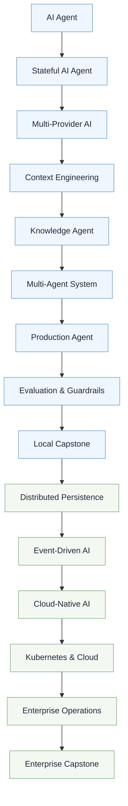
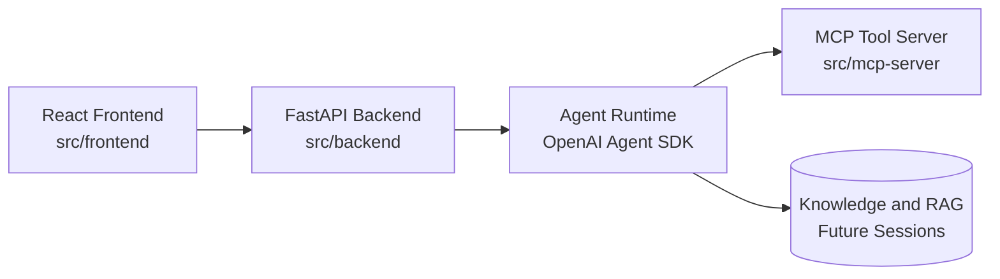

# Building AI Agents with OpenAI


One repo. One evolving app. Fifteen sessions from first agent to enterprise operations.

This is the hands-on workshop repository for **Swamy's Tech Skills Academy**.
You build one product end-to-end with React + FastAPI + OpenAI Agent SDK + MCP,
then level it up session by session.

Use this as the **Teaching Product**: clone it, run the demo, and follow the
published session guides.

---

## 1. Learning journey



## 2. Learning promise

By following this repository, you will learn how to:

- Design and run a production-style AI agent workflow.
- Build with React, FastAPI, OpenAI Agent SDK, and MCP tools.
- Progress from local demos to cloud-native and enterprise patterns.

---

## 3. The 5 pillars

This workshop aligns to a full modern AI delivery stack:

1. LLM foundation and prompting: model behavior, tool use, and reliability.
2. GenAI application patterns: UX, API orchestration, and observability.
3. RAG and knowledge workflows: retrieval strategy and grounded responses.
4. Agent systems: state, tools, planning, and multi-agent composition.
5. Agentic AI in production: guardrails, evaluation, and operations.

---

## 4. Session roadmap and tags

| Session | Theme | Status | Release tag |
| ------- | ----- | :----: | ----------- |
| 1 | Build Your First AI Agent | ✅ Available | `v1.0-build-your-first-agent` |
| 2 | Stateful Agents | 🚧 Coming Soon | - |
| 3 | Multi-Provider Agents | 🚧 Coming Soon | - |
| 4 | Context Engineering | 🚧 Coming Soon | - |
| 5 | Knowledge-Driven Agents | 🚧 Coming Soon | - |
| 6 | Multi-Agent Engineering | 🚧 Coming Soon | - |
| 7 | Production Foundations | 🚧 Coming Soon | - |
| 8 | Evaluation and Guardrails | 🚧 Coming Soon | - |
| 9 | Local Capstone | 🚧 Coming Soon | - |
| 10-15 | Platform and Enterprise Track | 🚧 Coming Soon | - |

Current working branch: `swamy/16jul-work` (WIP)

Quick checkout for Session 1:

```bash
git fetch --tags
git checkout v1.0-build-your-first-agent
```

---

## 5. 3 minute quick start

From repository root:

```powershell
uv sync --all-groups
Copy-Item .env.example .env
uv run uvicorn app.main:app --app-dir src/backend --reload --port 8000
```

In a second terminal:

```powershell
cd src/frontend
npm install
npm run dev
```

Open:

- App: [http://localhost:5173/demo/level-2](http://localhost:5173/demo/level-2)
- Health: [http://127.0.0.1:8000/health](http://127.0.0.1:8000/health)

---

## 6. Architecture at a glance



---

## 7. Session 1 - Build Your First AI Agent

**Tag:** `v1.0-build-your-first-agent`

Guide: [sessions/session-01-build-your-first-agent/README.md](sessions/session-01-build-your-first-agent/README.md)

---

## 8. Docs

- [docs/01-folder-structure.md](docs/01-folder-structure.md)
- [docs/02-how-to-execute.md](docs/02-how-to-execute.md)

---

## 9. What's in this repo

```text
building-ai-agents-with-openai/
├── README.md          ← product homepage (this file)
├── docs/              # Supporting repository docs
├── src/               # Latest released application
├── sessions/          # Released session guides only
├── LICENSE
├── .env.example
├── pyproject.toml
└── uv.lock
```

---

## 10. How to run today's demo

Use the full execution guide:

- [docs/02-how-to-execute.md](docs/02-how-to-execute.md)

Quick links:

- Level 2 dashboard: [http://localhost:5173/demo/level-2](http://localhost:5173/demo/level-2)
- Health check: [http://127.0.0.1:8000/health](http://127.0.0.1:8000/health)

---

## 11. Stack

- **Frontend:** React, TypeScript, Vite, Tailwind CSS
- **Backend:** Python 3.13, FastAPI, OpenAI Agent SDK, Pydantic
- **Tools:** Model Context Protocol (MCP), FastMCP

---

## 12. How to use this repository

For learners:

1. Start with [sessions/session-01-build-your-first-agent/README.md](sessions/session-01-build-your-first-agent/README.md).
2. Run the app locally and observe each maturity level.
3. Move session by session as release tags are published.

For instructors:

1. Use this repository as a teaching product for live demos.
2. Keep examples and run commands tied to the released tag.
3. Use `swamy/16jul-work` to stage upcoming updates.

---

## 13. License

MIT — see [LICENSE](LICENSE).
