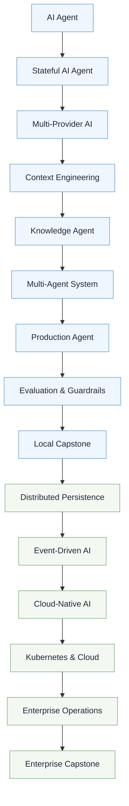

# Building AI Agents with OpenAI


This is the hands-on workshop repository for **Swamy's Tech Skills Academy**. You will learn through one evolving app (React + FastAPI + OpenAI Agent SDK + MCP) across live sessions.

Use this as the **Teaching Product**: clone it, run the current demo, and follow the published session guides.

---

## 1. Learning journey



	## 2. Session roadmap

	| Session | Status |
	| ------- | :----: |
	| Session 1 – Build Your First AI Agent | ✅ Available |
	| Session 2 – Stateful Agents | 🚧 Coming Soon |
	| Session 3 – Multi-Provider Agents | 🚧 Coming Soon |
	| Session 4 – Context Engineering | 🚧 Coming Soon |
	| Session 5 – Knowledge-Driven Agents | 🚧 Coming Soon |
	| Session 6 – Multi-Agent Engineering | 🚧 Coming Soon |
	| Session 7 – Production Foundations | 🚧 Coming Soon |
	| Session 8 – Evaluation & Guardrails | 🚧 Coming Soon |
	| Session 9 – Local Capstone | 🚧 Coming Soon |
	| Sessions 10–15 – Platform / enterprise track | 🚧 Coming Soon |

## 3. Session 1 - Build Your First AI Agent

**Tag:** `v1.0-build-your-first-agent`

Guide: [sessions/session-01-build-your-first-agent/README.md](sessions/session-01-build-your-first-agent/README.md)

---

## 4. Docs

- [docs/01-folder-structure.md](docs/01-folder-structure.md)
- [docs/02-how-to-execute.md](docs/02-how-to-execute.md)

---

## 5. How to run today's demo

Use the full execution guide:

- [docs/02-how-to-execute.md](docs/02-how-to-execute.md)

Quick links:

- Level 2 dashboard: [http://localhost:5173/demo/level-2](http://localhost:5173/demo/level-2)
- Health check: [http://127.0.0.1:8000/health](http://127.0.0.1:8000/health)

---

## 6. What's in this repo

```text
building-ai-agents-with-openai/
├── README.md          ← product homepage (this file)
├── docs/              # Supporting repository docs
├── src/               # Latest released application
├── sessions/          # Released session guides only
├── LICENSE
├── .env.example
├── pyproject.toml
└── uv.lock
```

`main` always tracks the **latest stable release**. Earlier milestones:

```bash
git fetch --tags
git checkout v1.0-build-your-first-agent
```

---

## 7. Stack

- **Frontend:** React, TypeScript, Vite, Tailwind CSS
- **Backend:** Python 3.13, FastAPI, OpenAI Agent SDK, Pydantic
- **Tools:** Model Context Protocol (MCP), FastMCP

---

## 8. License

MIT — see [LICENSE](LICENSE).
