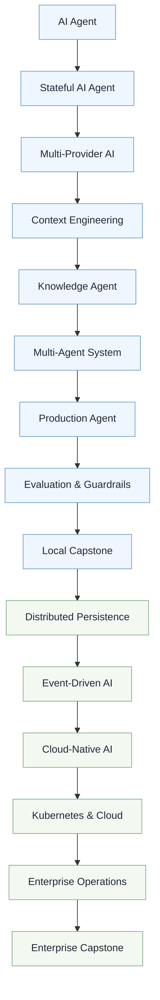
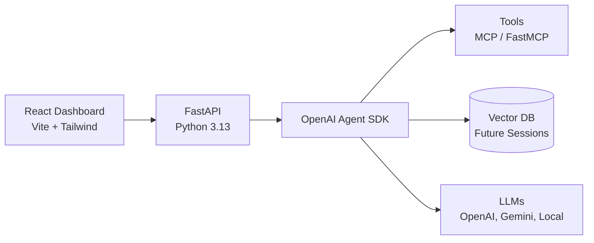

# Building AI Agents with OpenAI - Swamy's Tech Skills Academy

> One repo. One evolving app. Fifteen sessions from first agent to enterprise.

[](https://www.python.org/)
[](https://fastapi.tiangolo.com/)
[](https://react.dev/)
[](https://openai.github.io/openai-agents-python/)
[](https://modelcontextprotocol.io/)


This is the hands-on workshop repository for **Swamy's Tech Skills Academy**.
You do not build fifteen toy apps. You evolve one production-grade app built
with React + FastAPI + OpenAI Agent SDK + MCP across live sessions.

Use it to learn, teach, and ship.

---

## 1. Why this repo

Most AI tutorials stop at a notebook. Enterprises need reliable,
evaluatable, and deployable systems.

You will master the five pillars of enterprise AI in one codebase:

1. LLMs: the intelligence layer
2. Generative AI: the creation layer
3. RAG: the reliability layer
4. AI Agents: the execution layer
5. Agentic AI: the autonomy layer

Each session adds one pillar in code. By Session 15, you have a
cloud-native, multi-agent platform.

---

## 2. Session roadmap and tags

| Session | Focus | Status | Guide/Tag |
| ------- | ----- | :----: | --------- |
| 1 | Build Your First AI Agent | ✅ Available | [sessions/session-01-build-your-first-agent/README.md](sessions/session-01-build-your-first-agent/README.md) (intended tag: `v1.0-build-your-first-agent`) |
| 2 | Stateful Agents | 🚧 Next | Coming soon |
| 3 | Multi-Provider Agents | 🚧 Planned | Coming soon |
| 4 | Context Engineering | 🚧 Planned | Coming soon |
| 5 | Knowledge-Driven Agents | 🚧 Planned | Coming soon |
| 6 | Multi-Agent Engineering | 🚧 Planned | Coming soon |
| 7 | Production Foundations | 🚧 Planned | Coming soon |
| 8 | Evaluation and Guardrails | 🚧 Planned | Coming soon |
| 9 | Local Capstone | 🚧 Planned | Coming soon |
| 10-15 | Platform and Enterprise Track | 🚧 Planned | Coming soon |

---

## 3. Learning journey



---

## 4. Architecture



---

## 5. Stack

- Frontend: React 19, TypeScript, Vite, Tailwind CSS
- Backend: Python 3.13, FastAPI, Pydantic, OpenAI Agent SDK
- Agent tools: Model Context Protocol (MCP), FastMCP
- Tooling: uv, pytest

---

## 6. Quick start (3 minutes to first agent)

### Prerequisites

- Python 3.13+ and `uv`
- Node.js 20+
- OpenAI API key

### 1) Setup

```powershell
uv sync --all-groups
Copy-Item .env.example config\.env
# Add OPENAI_API_KEY to config/.env
```

### 2) Run backend

```powershell
uv run uvicorn app.main:app --app-dir src/backend --reload --port 8000
```

### 3) Run frontend

```powershell
cd src/frontend
npm install
npm run dev
```

Open [http://localhost:5173/demo/level-2](http://localhost:5173/demo/level-2).
Validate API home [http://127.0.0.1:8000/](http://127.0.0.1:8000/),
Swagger [http://127.0.0.1:8000/docs](http://127.0.0.1:8000/docs),
and health [http://127.0.0.1:8000/health](http://127.0.0.1:8000/health).

Full guide: [docs/02-how-to-execute.md](docs/02-how-to-execute.md)

---

## 7. Project structure

```text
building-ai-agents-with-openai/
├── .github/                     # Rules, skills, agents, workflows
├── docs/                        # Runbooks and supporting docs
├── sessions/                    # Published workshop guides
│   └── session-01-build-your-first-agent/
├── src/
│   ├── backend/                 # FastAPI + Agents SDK runtime
│   ├── frontend/                # React dashboard
│   └── mcp-server/              # MCP tool server
├── config/                      # Local secrets home (`config/.env`)
├── .env.example                 # Template → copy to config/.env
├── pyproject.toml
└── README.md
```

Details: [docs/01-folder-structure.md](docs/01-folder-structure.md)

---

## 8. How to use this repo

If you are a learner:

1. Use `main` (or the published session tag once it exists).
2. Run the demo.
3. Follow the guide in [sessions/](sessions/).

If you are an instructor:

1. Use this repo as your teaching product.
2. Prefer published tags for reproducible demos once tags are created.
3. Use a `swamy/**` branch for staging upcoming changes.

---

## 9. Docs and license

- Docs: [docs/01-folder-structure.md](docs/01-folder-structure.md), [docs/02-how-to-execute.md](docs/02-how-to-execute.md), [docs/03-versioning-branching.md](docs/03-versioning-branching.md), [docs/04-releases.md](docs/04-releases.md)
- License: MIT, see [LICENSE](LICENSE)
