# Agentic Engineering in Practice — Master Plan v2.0

> **Status:** Design frozen — Curriculum v1.0 baseline
> **Canonical structure:** [01-repository-structure.md](./01-repository-structure.md)
> **Public overview:** [README.md](../README.md)

---

## Audience Contract

This curriculum is written for **practicing software engineers** who can build web APIs and frontends but are new to **agentic system design**. It is not an ML-from-scratch course, a prompt-engineering tips series, or a survey of every agent framework.

| | |
| --- | --- |
| **Primary audience** | Backend and full-stack engineers learning to build and operate production-inspired AI agents |
| **Secondary audience** | Software architects evaluating agent runtime patterns, MCP, observability, and platform evolution |
| **Comfortable with** | Python, Git, REST APIs, basic React/TypeScript, environment configuration (see [03-getting-started.md](./03-getting-started.md)) |
| **Not required** | Deep ML training, data-science workflows, or prior OpenAI Agent SDK experience |

**Expected outcomes** (by Session 15): participants can build an evolving agent application, integrate tools via MCP, add providers and context policies, ground answers with RAG, orchestrate multiple agents, observe and test agent behavior, and deploy with a production-inspired operating model. Details in [§17 Learning outcomes](#17-learning-outcomes).

**What this curriculum is not:**

- A **tool zoo** — LangChain, LangGraph, CrewAI, AutoGen, and similar stacks are out of scope for the core spine (extensions only; see Design Freeze).
- A **chatbot tutorial** — the Agent Dashboard and Decision Timeline teach engineering observability, not conversation UX alone.
- A **replace-your-day-job-in-one-session** course — pace assumes incremental evolution across 15 sessions on one codebase.

Pace, depth, and examples assume an **engineering club** audience: strong coders, agent concepts taught from first principles, one major architectural question per session.

---

## 1. Vision

**Agentic Engineering in Practice** is a hands-on learning repository that demonstrates how to build, evolve, and operate production-grade AI systems using modern software engineering principles.

Rather than building isolated toy applications, this repository evolves **one codebase** across a series of club sessions. Each session introduces one major capability while preserving and extending everything built previously.

By the end of the full curriculum, participants will have watched one system grow from a simple tool-calling agent into a distributed, observable, cloud-ready AI platform.

---

## Capability Roadmap

| Status | Meaning |
| ------ | ------- |
| **Implemented** | Available in the current repository. |
| **Scheduled** | Planned for a published future session. |
| **Optional** | Bonus, extension, or take-home exercise tied to the roadmap. |
| **Future** | Beyond the published roadmap. |

**Capability vs technology:** The **Capability** column names an engineering outcome the curriculum teaches. The **Technology** column names the implementation chosen for this repository (may differ in extensions or enterprise deployments). Do not conflate "PostgreSQL" with the capability "distributed persistence."

| Capability | Technology | Status | Session | Phase | Learning goal |
| ---------- | ---------- | ------ | ------- | ----- | ------------- |
| Demo 1 UI routing (Home + maturity paths) | React, react-router-dom | Implemented | 1 | Phase I | Level 1 vs Level 2 contrast in one app |
| Level 1 Direct LLM baseline | `POST /api/llm` | Implemented | 1 | Phase I | Raw LLM before Agent Runtime |
| Agent observability (dashboard) | React Agent Dashboard | Implemented | 1 | Phase I | Visible decisions, not black-box chat |
| API boundary | FastAPI | Implemented | 1 | Phase I | Clean UI/runtime separation |
| Agent orchestration | OpenAI Agent SDK | Implemented | 1 | Phase I | Agent loop fundamentals |
| Model access | OpenAI API | Implemented | 1 | Phase I | Lowest-friction model path |
| Tool integration | MCP server | Implemented | 1 | Phase I | Standard tool plug shape |
| Deterministic tools | Calculator, weather MCP tools | Implemented | 1 | Phase I | Tool calling patterns |
| Structured execution visibility | Decision Timeline | Implemented | 1 | Phase I | Backend ↔ UI event contract |
| Conversation state | SQLite session store | Scheduled | 2 | Phase I | Stateful agents |
| Responsive UX | Streaming responses | Scheduled | 2 | Phase I | Token-by-token feedback |
| Reusable tool patterns | Enhanced MCP modules | Scheduled | 2 | Phase I | Production-shaped tools |
| Provider abstraction | LLM Provider Interface | Scheduled | 3 | Phase I | Multi-vendor model access |
| Enterprise model platform | AWS Bedrock | Scheduled | 3 | Phase I | IAM, managed models |
| Enterprise model extension | Azure OpenAI | Optional | 3 | Phase I | Open/Closed provider pattern |
| LLM context assembly | Context engineering | Scheduled | 4 | Phase I | What to send the model |
| Context window management | Context compression | Scheduled | 4 | Phase I | Token budget policies |
| Knowledge retrieval | RAG | Scheduled | 5 | Phase I | Grounded answers |
| Semantic search | Embedded vector store | Scheduled | 5 | Phase I | Local retrieval demo |
| Knowledge as a tool | `search_docs()` MCP tool | Scheduled | 5 | Phase I | Retrieval via tool registry |
| Agent collaboration | Multi-agent orchestration | Scheduled | 6 | Phase I | Planner + specialists |
| Production readiness | Docker, CI, health checks | Scheduled | 7 | Phase I | Deployable application |
| AI quality and safety | Evals and guardrails | Scheduled | 8 | Phase I | Measurable behavior |
| Local integrated application | Local capstone | Scheduled | 9 | Phase I | Compose prior capabilities |
| Cross-conversation personalization | Persistent user memory | Future | TBD | Future | Long-term user profiles |
| Distributed persistence | PostgreSQL (+ pgvector path) | Scheduled | 10 | Phase II | Data across services |
| Event-driven agents | Kafka | Scheduled | 11 | Phase II | Async workflows |
| Cloud-native orchestration | .NET Aspire | Scheduled | 12 | Phase II | Distributed local/cloud shape |
| Policy-driven model traffic | Model Gateway | Scheduled | 12 | Phase II | Routing, fallback, policy |
| Cloud deployment | Kubernetes, AWS | Scheduled | 13 | Phase II | Run in cloud |
| Enterprise operating model | Identity, RBAC, governance | Scheduled | 14 | Phase II | Operate the platform |
| Enterprise integrated system | Enterprise capstone | Scheduled | 15 | Phase II | End-to-end enterprise demo |

---

## Design Freeze

This document defines the baseline architecture and curriculum for the Swamy's Tech Skills Academy.

No new sessions, architectural layers, or foundational abstractions should be introduced unless:

- A completed session demonstrates a genuine gap.
- Attendee feedback consistently identifies a missing concept.
- A production use case cannot be explained using the existing curriculum.

New technologies may be added only when they answer a fundamentally new engineering question.

Future ideas should be classified before changing the roadmap:

| Bucket | Meaning | Decision rule |
| ------ | ------- | ------------- |
| **Bug** | Something is incorrect, inconsistent, or broken. | Fix immediately. |
| **Improvement** | Makes an existing session clearer or better. | Accept when it preserves the session's question. |
| **Extension** | Optional content such as Anthropic, Gemini, Ollama, or Qdrant. | Capture in an ADR or lab without changing the core curriculum. |
| **New Curriculum** | Requires changing multiple sessions or the learning spine. | Defer until after Season 1 is taught. |

The focus now shifts from planning to implementation.

After this baseline is committed, tag it as `curriculum-v1.0` so future changes can be evaluated against the frozen design.

### Documentation governance

Each document type has **one responsibility**. Avoid copying full explanations across files — link to the canonical home instead.

| Document | Responsibility |
| -------- | -------------- |
| **Co-architect guidance** (`co-architect-operating-guidance.md`) | Decision constitution: classification, personal learning vs curriculum, promotion path |
| **Master plan** (`02-master-plan.md`) | Defines curriculum architecture, session spine, and roadmap |
| **README** | Public summary and entry point — links inward, does not duplicate deep specs |
| **Topic guides** (`docs/NN-*.md`) | Canonical home for one concept (e.g. RAG, MCP, tool calling) |
| **ADRs** (`docs/ADRs/`) | Justifies a specific architectural decision |
| **Architecture views** (`docs/architecture/`) | Describes system structure at a point in time |
| **Presentation** (`presentation/demo-0N/`) | Teaches a session live — script and runbook, not a second master plan |

**Canonical-home rule:** Every concept has exactly **one** authoritative doc. Elsewhere, use a short pointer.

| Concept | Canonical home |
| ------- | -------------- |
| Agent Dashboard, Decision Timeline, Tool Registry | [13-observability-dashboard.md](./13-observability-dashboard.md) |
| Repository layout | [01-repository-structure.md](./01-repository-structure.md) |
| Developer setup | [03-getting-started.md](./03-getting-started.md) |
| Agent maturity levels | [§4.1](#41-agent-maturity-levels) in this document |
| Session presenter flow | `presentation/demo-0N/README.md` |

When a diagram or contract changes, update the **canonical home first**, then adjust links — not five parallel copies.

**Presentation split (maintainability):** Demo guides may grow large. Prefer splitting `presentation/demo-0N/` into focused artifacts over time (e.g. presenter script, hands-on steps, architecture notes) rather than one monolithic README per session. Demo 1 remains combined until Session 1 is taught once and split points are clear.

---

## 2. Design goals

Every architectural decision in this repository should support these goals:

| Goal | Meaning |
| ---- | ------- |
| **Simple** | Session 1 stays approachable: Agent Runtime, OpenAI Agent SDK, MCP, and tool calling. |
| **Observable** | The system exposes structured execution events through the Decision Timeline. |
| **Incremental** | Each session adds one visible capability without rewriting earlier work. |
| **Extensible** | The architecture can grow into memory, RAG, multi-agent orchestration, production hardening, and evaluation. |
| **Production-inspired** | Patterns resemble real engineering systems without overwhelming learners early. |
| **Educational** | Concepts appear when the audience has enough context to understand why they matter. |

Examples:

- Agent Dashboard → **Observable**
- Git tags → **Incremental**
- One evolving application → **Extensible**
- MCP → **Separation of concerns** and tool extensibility
- LLM Provider Interface in Session 3 → **Educational** because the audience has already seen a working stateful agent and can now feel the AWS enterprise-platform requirement
- Optional Azure OpenAI provider after Session 3 → **Extensible** because adding a provider demonstrates the Open/Closed Principle without changing the provider interface
- Model Gateway in Phase II → **Production-inspired** once routing, fallback, retries, caching, telemetry, cost, and policy become platform concerns

---

## 3. Guiding principles

| Principle | What it means |
| --------- | ------------- |
| **One system, not many demos** | Do not create `demo1/`, `demo2/`, or separate repositories per session. Extend the same app. |
| **Incremental evolution** | Session *N* builds on session *N − 1* — exactly how real software grows. |
| **Engineering over chat** | Prefer an **Agent Dashboard** (timeline, tool registry, execution panels) over a plain chatbot UI. |
| **Structured observability** | Expose a **Decision Timeline** of execution events — not raw model reasoning. |
| **Introduce one major concept per session** | Each session should introduce one major architectural concept. Advanced abstractions are introduced only when their value becomes apparent. |
| **Defer abstractions until they teach** | Add advanced boundaries only when they solve a visible problem in the learning path. |
| **Technology follows need** | Every new technology must solve a problem introduced in the previous session. |
| **Freeze before building** | Once the curriculum answers the core engineering questions, implementation takes priority over further roadmap expansion. |
| **Document alongside code** | Update `docs/`, `sessions/session-NN-*/`, and `presentation/demo-0N/` (transitional) with every session. |
| **Tag milestones** | Mark completed sessions with Git tags so attendees can revisit any point in time. |

### What we rejected

- ❌ One repository per demo
- ❌ Top-level folders like `01-build-your-first-ai-agent/`, `02-memory-and-conversation/`
- ❌ Parallel `demo1/`, `demo2/` application trees inside `src/`
- ❌ Renaming core directories between session tags (e.g. `agent/` → `agent_runtime/`) — pick final names in Session 1 so every tag diff is strictly additive
- ❌ Introducing a Provider Pattern in Session 1 — first teach the agent loop, then refactor when vendor lock-in is visible
- ❌ Introducing an enterprise Model Gateway in Session 1 — start with the agent loop, then add provider abstraction, then add routing infrastructure
- ❌ Calling the future LLM boundary a "proxy" — when introduced, this repo uses **Model Gateway** because it owns provider abstraction and policy

---

## Architecture Decisions

Detailed records live under `docs/ADRs/`.

| ADR | Decision | Status |
| --- | -------- | ------ |
| [ADR-001](./ADRs/ADR-001-single-codebase.md) | Use a single evolving application instead of multiple demo applications. | Accepted |
| [ADR-002](./ADRs/ADR-002-git-tags.md) | Use Git tags instead of long-lived branches to represent session milestones. | Accepted |
| [ADR-003](./ADRs/ADR-003-dashboard.md) | Use an Agent Dashboard instead of a traditional chatbot interface. | Accepted |
| [ADR-004](./ADRs/ADR-004-event-contract.md) | Expose structured Decision Timeline events instead of model reasoning. | Accepted |
| [ADR-005](./ADRs/ADR-005-provider-before-gateway.md) | Use a Provider Pattern before introducing a Gateway Pattern. | Accepted |
| [ADR-006](./ADRs/ADR-006-aspire-for-microsoft-orchestration.md) | Include .NET Aspire as a Microsoft-centric distributed orchestration pattern. | Accepted |
| [ADR-007](./ADRs/ADR-007-demo-routing-level1-level2.md) | Use client-side routing (Home + Level 1 + Level 2) instead of tabs or a full demo shell. | Accepted |
| [ADR-008](./ADRs/ADR-008-product-organization-publishing.md) | Product organization + publishing; course is a pedagogical projection of `src/`. Declares **Repository Architecture v1.0** (frozen). Complements ADR-001 and ADR-002. | Accepted |

---

## 4. Architecture mental model

Think in layers, not in framework names. The **Agent Runtime** owns **model interaction** and **tool interaction** as siblings — the OpenAI Agent SDK is Session 1's *implementation* of model access, not a layer that contains MCP.

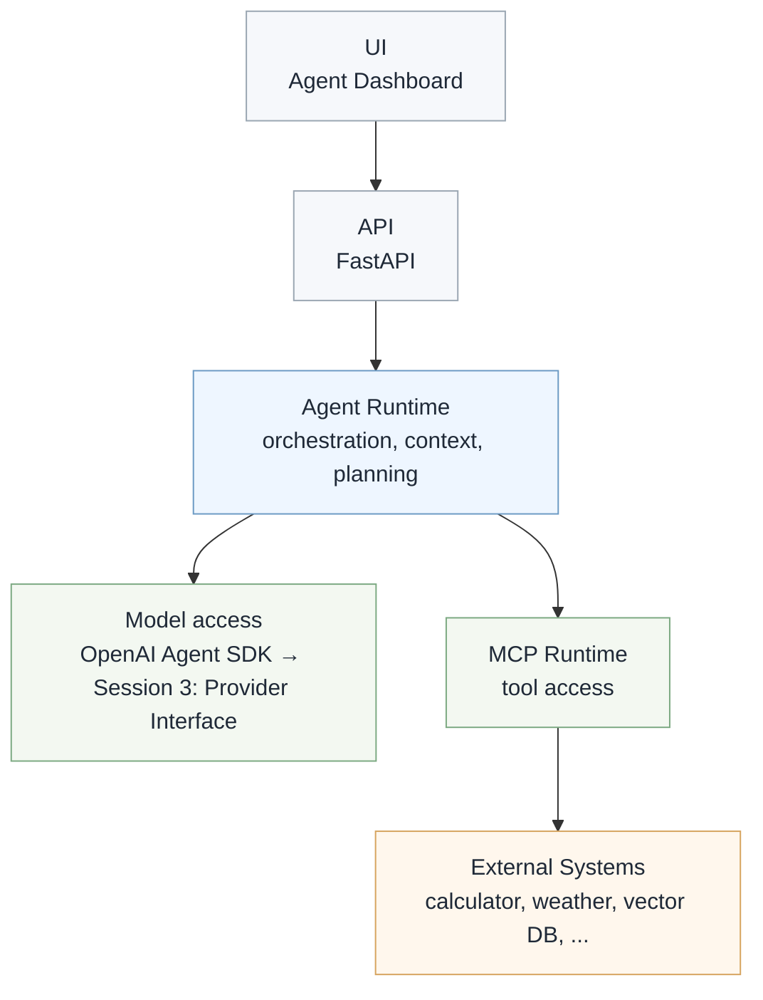

ASCII fallback:

```text
UI (Agent Dashboard)
        │
        ▼
API (FastAPI)
        │
        ▼
Agent Runtime (orchestration, context, planning)
    │
    ├── Model access (OpenAI Agent SDK in Session 1; Provider Interface from Session 3)
    │
    └── MCP Runtime (tool access)
            │
            ▼
        External Systems (calculator, weather, vector DB, …)
```

This framing makes later additions — provider abstraction, working context, RAG, multi-agent orchestration, evaluation — fit naturally without restructuring.

Session 1 is intentionally direct. It teaches the agent loop before asking learners to understand provider abstraction:

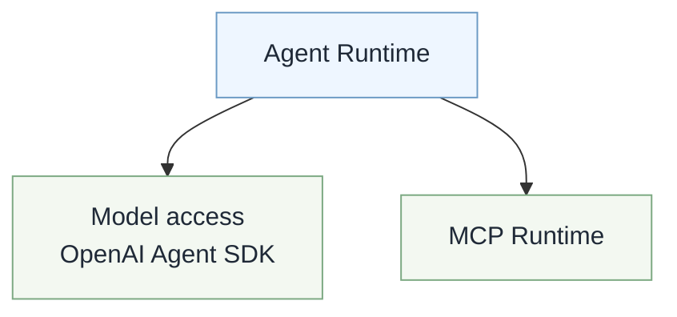

```text
Agent Runtime
    │
    ├── Model access (OpenAI Agent SDK → OpenAI API)
    │
    └── MCP Runtime (calculator, weather, …)
```

Tools are **not** inside the SDK. The runtime coordinates both paths.

Session 3 introduces the smallest useful abstraction after learners have seen the limitation of one provider:

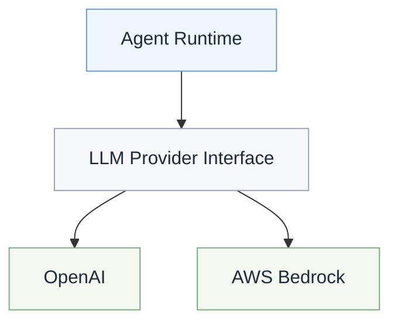

```text
Agent Runtime
    │
    ▼
LLM Provider Interface
    ├── OpenAI
    └── AWS Bedrock
```

Azure OpenAI is an optional provider extension after Session 3. The provider interface remains unchanged; adding Azure OpenAI requires a new implementation, not a rewrite of existing behavior:

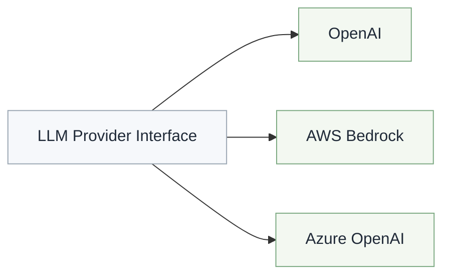

```text
LLM Provider Interface
    ├── OpenAI
    ├── AWS Bedrock
    └── Azure OpenAI
```

Phase II adds a production Model Gateway above the provider interface when gateway behavior has a real platform problem to solve. The provider interface remains the adapter layer for provider-specific SDKs and APIs:

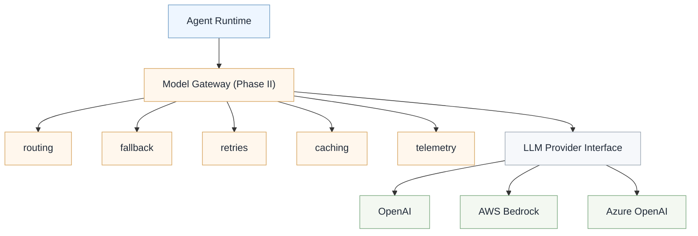

```text
Agent Runtime
    │
    ▼
Model Gateway (Phase II)
    │
    ├── routing
    ├── fallback
    ├── retries
    ├── caching
    ├── telemetry
    └── LLM Provider Interface
        ├── OpenAI
        ├── AWS Bedrock
        └── Azure OpenAI
```

### Agent Runtime (backend package — locked from Session 1)

Organize backend orchestration under **`agent_runtime/` from the first commit**, even though Session 1 only needs a handful of files. A rename between `v1.0` and `v2.0` would violate the incremental-evolution rule and pollute tag diffs with moves instead of additions.

```text
src/backend/app/
├── api/                    # REST routes (chat, llm, health, sessions)
├── agent_runtime/          # Heart of the application — final name, Session 1 onward
│   ├── agent.py
│   ├── direct_llm.py       # Level 1 — POST /api/llm (no MCP, no events)
│   ├── instructions.py
│   ├── models.py           # AgentMaturityLevel, DecisionEvent, Chat/Llm/Health responses
│   ├── event_bus.py        # Emits Decision Timeline events
└── services/               # Shared infrastructure helpers (later sessions)
```

[01-repository-structure.md](./01-repository-structure.md) uses this same layout.

### 4.1 Agent Maturity Levels

The curriculum evolves one application through increasing levels of agent maturity. This taxonomy is an architectural lens — not a certification model — that explains **what changes** as an AI system matures. For example, Session 4 introduces Context Engineering; through this framework, that session moves the system toward **Autonomous Agent** maturity (Level 4).

| Level | Agent Type | Operational Autonomy | Contextual Awareness | Decision-Making Authority | Typical Use Case | Session Mapping |
| ----- | ---------- | -------------------- | -------------------- | ------------------------- | ---------------- | --------------- |
| **1** | Direct LLM Interaction | Stateless | None | Human-led | Q&A, content generation | Session 1 opening — `/demo/level-1`, `POST /api/llm` |
| **2** | Proxy Agent | Low | Prompt-scoped | Instruction-based | Tool calling, API translation | Session 1 — `/demo/level-2`, `POST /api/chat` |
| **3** | Assistant System | Medium | Session-based | User-guided | Conversational assistants | Sessions 2–3 |
| **4** | Autonomous Agent | High | Persistent working context with contextual reasoning | Partial autonomy | Planning, long-running tasks | Sessions 4–6 *(progressive)* |
| **5** | Multi-Agent System (MAS) | Very High | Shared distributed context | Distributed autonomy | Specialist coordination | Session 6 onward |

> Progression through these levels is incremental rather than discrete. A session may introduce capabilities associated with the next maturity level without fully implementing all characteristics of that level. The taxonomy is intended as a conceptual framework rather than a strict certification model.

**Level 5 is not only multi-agent.** Once the curriculum introduces distributed coordination (Session 6), later sessions deepen that same maturity through production operations, observability, governance, and enterprise deployment (Sessions 7–15).

#### Memory types (avoiding a common confusion)

Level 4 speaks of **working context** (what the runtime assembles and sends to the model), not cross-conversation personalization. Three distinct context/memory concepts appear at different points in the curriculum:

| Concept | Example | Curriculum |
| ------- | ------- | ---------- |
| Conversation State | Current chat history | Session 2 |
| Agent Working Context | Context assembly, summaries, planning state | Sessions 4–6 |
| Persistent User Memory | Cross-conversation personalization | Future (see Capability Roadmap) |

Persistent user memory remains a **Future** capability in the Capability Roadmap. Sessions 4–6 teach how the agent assembles, compresses, and reasons over **working context** within and across requests — not long-term user profiles.

#### Session → maturity mapping

| Session | Architectural Question | Maturity Level |
| ------- | ---------------------- | -------------- |
| **1** | How does an Agent think and use tools? | Level 2 |
| **2** | How does an Agent maintain conversations? | Level 3 |
| **3** | How do we support multiple LLM providers? | Level 3 |
| **4** | How do we build contextual reasoning? | Level 4 |
| **5** | How does an Agent access external knowledge? | Level 4 |
| **6** | How do Agents collaborate? | Level 5 |
| **7** | How do we operate Agents? | Level 5 |
| **8** | How do we evaluate Agents? | Level 5 |
| **9–15** | Enterprise evolution | Level 5 |

#### Level 1 baseline (Session 1 opening)

Level 1 has no dedicated session tag of its own — it is a **thin contrast path** inside Demo 1. Spend the **first five minutes of Session 1** on `/demo/level-1`, then move to `/demo/level-2` for the Agent Runtime the club builds and ships.

**Frontend routes (Demo 1):**

| Route | Maturity | UI | API |
| ----- | -------- | -- | --- |
| `/` | Overview | Home — maturity ladder + CTAs | — |
| `/demo/level-1` | Level 1 | Prompt + response only (no timeline) | `POST /api/llm` |
| `/demo/level-2` | Level 2 | Agent Dashboard (Session 1 deliverable) | `POST /api/chat` |

**Level 1 flow** — no Agent Runtime orchestration, MCP, tools, or Decision Timeline events:

```text
User
   │
   ▼
Raw LLM Prompt
   │
   ▼
LLM Response
```

**Level 2 flow** — contrast immediately after Level 1:

```text
User
   │
   ▼
Agent Runtime
   │
   ├── Instructions
   ├── Tool Selection
   ├── MCP
   └── Decision Timeline
```

**Suggested compare prompt:** ask `What is 15 * 23?` on Level 1 (text only, no tool trace), then the same on Level 2 (watch `calculate` in the Decision Timeline).

That transition makes the move from "chatting with an LLM" to "building an agent" immediately obvious before live-coding or extending the Session 1 runtime.

**Backend boundaries:**

| Endpoint | Handler | Response model (`models.py`) |
| -------- | ------- | ---------------------------- |
| `GET /health` | `main.py` | `HealthResponse` — `{ status, demo, maturityLevel, maturityName }` |
| `POST /api/llm` | `api/llm.py` (delegates to `agent_runtime/direct_llm.py`) | `LlmResponse` — `{ response, maturityLevel, maturityName }` — no `events[]` |
| `POST /api/chat` | `api/chat.py` (delegates to `agent_runtime/agent.py`) | `ChatResponse` — `{ response, events[], sessionId, requestId, maturityLevel, maturityName }` — Level 2 |

All three response models use **camelCase** JSON field names (see [ADR-007](./ADRs/ADR-007-demo-routing-level1-level2.md)).

Level 1 intentionally stays thin: one input, one output. Do not add tools, session memory, or timeline events to `/api/llm`.

---

## 5. Repository layout

Committed structure ([ADR-008](./ADRs/ADR-008-product-organization-publishing.md) — Repository Architecture v1.0):

```text
agentic-engineering-in-practice/
│
├── src/
│   ├── frontend/           # React + TypeScript + Vite + Tailwind
│   ├── backend/            # FastAPI + agent runtime + LLM providers
│   └── mcp-server/         # MCP tools (not mcp/ — scales to mcp-client, mcp-shared)
│
├── sessions/               # Course packages (tag-bound; no nested src/)
├── docs/                   # Global spine, ADRs, architecture (see §14)
├── presentation/           # demo-01 … demo-15 (transitional presenter home)
├── assets/                 # Shared media
├── examples/               # Optional talk/blog snippets
├── tools/                  # Repo tooling
├── _meta/                  # Publishing + release checklist
├── _internal/              # Never published
│
├── .env.example
├── .gitignore
├── LICENSE
└── README.md
```

Canonical detail: [01-repository-structure.md](./01-repository-structure.md). Release commands: [16-releases.md](./16-releases.md).

Why `mcp-server` instead of `mcp`?

```text
src/mcp-server/     ← today
src/mcp-client/     ← possible later
src/mcp-shared/     ← possible later
```

---

## 6. Agent Dashboard (UI concept)

Instead of a simple chat screen, build an **Agent Dashboard** with permanent panels. This teaches engineering concepts, not just conversation.

### Demo 1 UI shell (Home + Level 1 + Level 2)

Session 1 uses **client-side routing** (`react-router-dom`) so Level 1 and Level 2 live in one frontend without separate apps:

```text
/                 HomePage          — maturity ladder, links to both demos
/demo/level-1     Level1DemoPage    — Direct LLM (POST /api/llm)
/demo/level-2     Level2Dashboard   — Agent Dashboard (POST /api/chat)
```

The **Session 1 milestone** (`v1.0-build-your-first-agent`) is Level 2. Level 1 exists to teach the baseline; Home orients attendees before the live compare flow in §4.1.

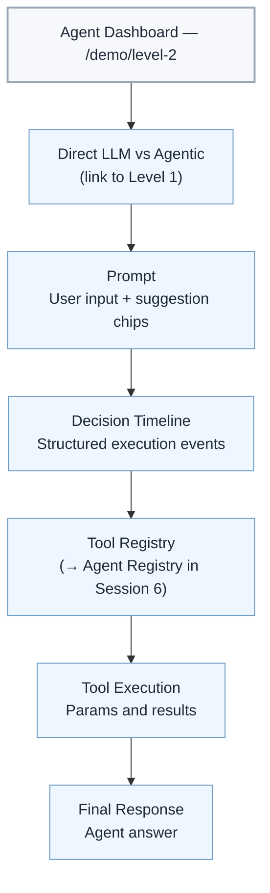

```text
┌─────────────────────────────────────────────────────────┐
│                   Agent Dashboard                       │
├─────────────────────────────────────────────────────────┤
│  Direct LLM vs Agentic  (collapse after opening)        │
├─────────────────────────────────────────────────────────┤
│  Prompt                                                 │
├─────────────────────────────────────────────────────────┤
│  Decision Timeline                                      │
├─────────────────────────────────────────────────────────┤
│  Tool Registry  (→ Agent Registry in Session 6)         │
├─────────────────────────────────────────────────────────┤
│  Tool Execution                                         │
├─────────────────────────────────────────────────────────┤
│  Final Response                                         │
└─────────────────────────────────────────────────────────┘
```

### UI evolution by session

| Session | Panels added or enhanced |
| ------- | ------------------------ |
| **1** | Home page; Level 1 demo route; Level 2 — Direct LLM vs Agentic, Prompt, Decision Timeline, Tool Registry, Tool Execution, Final Response |
| **2** | Conversation History, streaming in Final Response, Session State |
| **3** | Current Provider, Current Model, Provider Selector |
| **4** | Context Panel, context budget, prompt assembly, compression status |
| **5** | Knowledge Search, Retrieved Documents |
| **6** | Tool Registry → **Agent Registry** (Planner, specialists) |
| **7** | System Health, Request Tracing, Metrics |
| **8** | Evaluation Results, Guardrail Status, Security Events |
| **9** | Full local capstone dashboard |

> **Standing reference:** [13-observability-dashboard.md](./13-observability-dashboard.md) documents the Agent Dashboard, Decision Timeline, and Tool Registry pattern. Every session walkthrough links back to it instead of re-explaining the contract.

---

## 7. Decision Timeline (backend ↔ UI contract)

Display **structured execution events** instead of free-form strings or hidden chain-of-thought.

**Commit to event names early.** They are the stable contract between backend, UI, and Session 7+ tracing. Renaming events later breaks recorded demos and prior session replays.

**Decision Timeline event names and existing fields are considered stable public contracts. New events and fields may be added, but existing event names and fields should not be renamed or removed after Session 1.**

### Standard event sequence

| Order | Event | Description | Typical payload fields |
| ----: | ----- | ----------- | ---------------------- |
| 1 | `PromptReceived` | User request accepted | `metadata.prompt` |
| 2 | `IntentIdentified` | Agent determines what the user is asking | `metadata.intent` |
| 3 | `ExecutionPlanCreated` | Agent decides whether tools are required | `metadata.plan` |
| 4 | `ToolSelected` | Appropriate tool(s) chosen | `tool` |
| 5 | `ToolInvoked` | Tool call dispatched | `tool`, `params` |
| 6 | `ToolCompleted` | Tool returned successfully | `tool`, `result`, `latencyMs` |
| 7 | `ToolFailedHandled` | Recoverable failure; agent continues | `tool`, `error` (`recoverable: true`) → 🟡 |
| 8 | `ToolFailedUnhandled` | Unexpected tool failure; agent cannot recover | `tool`, `error` (`recoverable: false`) → 🔴 |
| 9 | `SystemErrorRaised` | Non-tool failure (runtime, API, timeout) | `error` (`recoverable: false`) → 🔴 |
| 10 | `ResponseSynthesized` | Outputs combined into a final answer | `metadata.summary` |
| 11 | `ResponseDelivered` | Answer sent to the UI | `result` (final text) |

Events **7–9** map directly to Tool Registry states in §8. `ToolFailedHandled` without a matching unhandled event would leave 🔴 with no driver — that gap is closed above.

Failure behavior can be taught progressively. Session 1 defines the event model and shows the happy path. Session 2 can introduce a handled failure, such as a malformed weather location that falls back to a default city or asks for clarification. Later sessions can demonstrate unhandled or system failures through simulated service outages, invalid API credentials, or deployment issues.

### §7.1 Event payload (backend ↔ frontend contract)

Events are **not** status strings. Both Session 1's Agent Dashboard (React) and Session 7's tracing consume the **same shape** — define it once, implement in TypeScript and Pydantic from commit one.

**TypeScript** (`src/frontend/src/types/decision-event.ts`):

```typescript
export type DecisionEventType =
  | "PromptReceived"
  | "IntentIdentified"
  | "ExecutionPlanCreated"
  | "ToolSelected"
  | "ToolInvoked"
  | "ToolCompleted"
  | "ToolFailedHandled"
  | "ToolFailedUnhandled"
  | "SystemErrorRaised"
  | "ResponseSynthesized"
  | "ResponseDelivered";

export interface DecisionEventError {
  code: string;           // e.g. "TOOL_TIMEOUT", "INVALID_INPUT", "RUNTIME_ERROR"
  message: string;
  recoverable: boolean;   // true → 🟡 ToolFailedHandled; false → 🔴
}

export interface DecisionEvent {
  event: DecisionEventType;
  timestamp: string;      // ISO 8601
  sessionId: string;
  requestId: string;
  sequence: number;       // monotonic per request
  tool?: string;
    agent?: string;         // Session 6+
  params?: Record<string, unknown>;
  result?: unknown;
  error?: DecisionEventError;
  latencyMs?: number;
  metadata?: Record<string, unknown>;
}
```

**Pydantic** (`src/backend/app/agent_runtime/models.py`) — mirror the same fields. The backend emits; the frontend renders. Session 7 observability indexes the identical stream.

**Response models (same module):** `ChatResponse` (`POST /api/chat`), `LlmResponse` (`POST /api/llm`), and `HealthResponse` (`GET /health`) — all serialize with camelCase aliases for the React client.

**Session 1 minimum:** `event`, `timestamp`, `sessionId`, `requestId`, `sequence`, plus `tool` / `params` / `result` / `error` when applicable.

**Session 7+:** same model feeds traces and metrics — no redesign.

### Multi-tool example

```text
PromptReceived
    → IntentIdentified
    → ExecutionPlanCreated
    → ToolSelected (Weather)
    → ToolSelected (Calculator)
    → ToolInvoked (Weather)
    → ToolInvoked (Calculator)
    → ToolCompleted (Weather)
    → ToolCompleted (Calculator)
    → ResponseSynthesized
    → ResponseDelivered
```

---

## 8. Tool Registry (visual states)

Formalize tool lifecycle in the UI. Semantic states below; the React Agent Dashboard
renders them with Font Awesome icons and text labels (`Available`, `Selected`, …) —
see `src/frontend/src/components/ToolRegistry.tsx` and [13-observability-dashboard.md](./13-observability-dashboard.md).

| State | Indicator | Meaning |
| ----- | --------- | ------- |
| Available | ⚪ | Tool registered but not used |
| Selected | 🔵 | Agent chose this tool |
| Running | 🟢 | Execution in progress |
| Success | ✅ | Completed successfully |
| Handled Failure | 🟡 | Recoverable error — driven by `ToolFailedHandled` (`error.recoverable === true`) |
| Failed | 🔴 | Unexpected error — driven by `ToolFailedUnhandled` (`error.recoverable === false`). Demo 1 Tool Registry implements this via tool-tagged `ToolFailedUnhandled` only; `SystemErrorRaised` stays on the Decision Timeline / Final Response |

The 🟡 / 🔴 split and §7 events reference each other: every registry success/failure state has a corresponding tool-tagged timeline event in Demo 1.

---

## 9. Learning journey

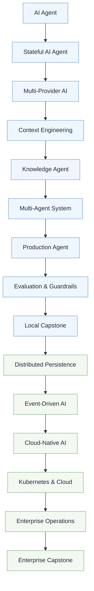

```text
AI Agent
    │
    ▼
Stateful AI Agent
    │
    ▼
Multi-Provider AI
    │
    ▼
Context Engineering
    │
    ▼
Knowledge Agent
    │
    ▼
Multi-Agent System
    │
    ▼
Production Agent
    │
    ▼
Evaluation & Guardrails
    │
    ▼
Local Capstone
    │
    ▼
Distributed Persistence
    │
    ▼
Event-Driven AI
    │
    ▼
Cloud-Native AI
    │
    ▼
Kubernetes & Cloud
    │
    ▼
Enterprise Operations
    │
    ▼
Enterprise Capstone
```

---

## 10. Curriculum roadmap

The curriculum has two sequential phases. They are not alternative tracks; each phase grows the same application into the next maturity level (see **§4.1 Agent Maturity Levels**).

### Phase I — AI Agent Engineering

**Goal:** Learn how to build intelligent applications.

| Session | Title | Focus |
| ------- | ----- | ----- |
| **0** | Developer Setup | Tooling, repository, environment, coding standards |
| **1** | Build Your First AI Agent | OpenAI Agent SDK, MCP, calculator, weather, Decision Timeline |
| **2** | Stateful Agents | Conversation, sessions, SQLite, streaming |
| **3** | Multi-Provider Agents | Provider Pattern, OpenAI, AWS Bedrock, IAM, Bedrock Runtime |
| **4** | Context Engineering | Context window, token limits, sliding window, compression, summarization, prompt assembly |
| **5** | Knowledge-Driven Agents | Embeddings, vector store, RAG, `search_docs()` MCP tool |
| **6** | Multi-Agent Engineering | Planner, delegation, specialist agents, MCP tool domains |
| **7** | Production Foundations | Docker, CI/CD, health checks, logging, foundational observability |
| **8** | Evaluation & Guardrails | Evals, guardrails, prompt injection, regression, testing |
| **9** | Local Capstone | Build a production-inspired AI application running locally |

### Phase II — AI Platform Engineering

**Goal:** Learn how to operate intelligent platforms.

| Session | Title | Focus |
| ------- | ----- | ----- |
| **10** | Distributed Persistence | PostgreSQL, persistence boundaries, distributed state, migration from SQLite |
| **11** | Event-Driven AI | Kafka, queues, background workers, retries, dead-letter queues |
| **12** | Cloud-Native AI | Docker Compose, .NET Aspire, service discovery, OpenTelemetry, Model Gateway |
| **13** | Kubernetes & Cloud | Kubernetes, AWS, Azure, Bedrock, secrets, ingress, scaling |
| **14** | Enterprise Operations | Identity, RBAC, governance, monitoring, cost, gateway policy |
| **15** | Enterprise Capstone | Deploy the same application to the cloud with an enterprise operating model |

**Why this ordering works:** each session answers one architectural question.

| Session | Engineering question |
| ------- | -------------------- |
| **1** | How does an Agent think and use tools? |
| **2** | How does an Agent continue a conversation? |
| **3** | How do we make our Agent cloud-provider independent? |
| **4** | What should we send to the LLM? |
| **5** | How does an Agent know things it was never trained on? |
| **6** | How do Agents collaborate? |
| **7** | How do we package and run our application? |
| **8** | How do we know our Agent is correct and safe? |
| **9** | Can we build a complete local AI application? |
| **10** | How do we persist data across services? |
| **11** | How do services communicate asynchronously? |
| **12** | How do we orchestrate distributed services and model traffic? |
| **13** | How do we deploy to the cloud? |
| **14** | How do we operate the platform? |
| **15** | Can we run the complete enterprise system? |

Phase II shifts from building intelligent applications to operating intelligent platforms.

The Phase I learning progression is:

```text
Tool Use → State → Provider → Context → Knowledge → Collaboration → Production → Quality → Real Project
```

The full curriculum progression is:

```text
Agent → State → Provider → Context → Knowledge → Collaboration → Production → Quality → Application → Platform → Cloud → Enterprise
```

### Three architectural threads

Three parallel capability tracks evolve across the curriculum:

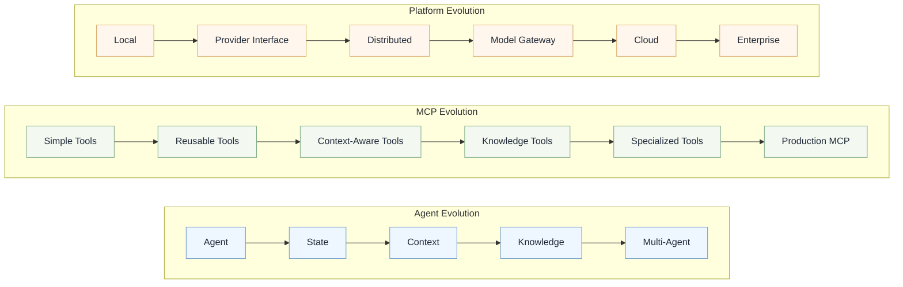

```text
Agent Evolution:    Agent → State → Context → Knowledge → Multi-Agent
MCP Evolution:      Simple Tools → Reusable Tools → Context-Aware Tools → Knowledge Tools → Specialized Tools → Production MCP
Platform Evolution: Local → Provider Interface → Distributed → Model Gateway → Cloud → Enterprise
```

| Thread | Progression |
| ------ | ----------- |
| **Agent Evolution** | Agent → State → Context → Knowledge → Multi-Agent |
| **MCP Evolution** | Simple Tools → Reusable Tools → Context-Aware Tools → Knowledge Tools → Specialized Tools → Production MCP |
| **Platform Evolution** | Local → Provider Interface → Distributed → Model Gateway → Cloud → Enterprise |

### MCP evolution by session

| Session | MCP role |
| ------- | -------- |
| **1** | Simple MCP server with calculator and weather tools; teach registration, discovery, and invocation. |
| **2** | Modular tool patterns with reusable schemas, structured errors, and timeouts. |
| **3** | Provider refactor leaves MCP unchanged, proving model boundaries and tool boundaries are separate. |
| **4** | Context-aware tools contribute explicit inputs to prompt assembly without owning application state. |
| **5** | Add `search_docs()` as a knowledge tool backed by embeddings and vector search. |
| **6** | Split tool domains for specialist agents; each agent sees only the tools it should use. |
| **7** | Productionize MCP with auth, versioning, monitoring, rate limiting, and deployment boundaries. |
| **8** | Evaluate tool behavior with regression cases, guardrails, and prompt-injection tests. |
| **9** | Compose the MCP patterns into the capstone application. |
| **10–15** | Extend MCP into platform patterns: distributed persistence, async workflows, cloud deployment, governance, and enterprise operations. |

### Session 7 vs Session 8 — CI/CD and eval boundary

| | Session 7 | Session 8 |
| - | --------- | --------- |
| **Theme** | Production fundamentals | Quality and safety |
| **Capability** | Build, test, package, deploy | Measure, evaluate, improve |
| **CI pipeline** | Lint, build, Docker package, smoke tests | Eval harness and regression gates |
| **Tests written** | Health checks, chat round-trip, tool-call happy path | Golden datasets, agent-quality evals, guardrail regression cases |

Production engineering and AI quality stay distinct: Session 7 makes the system deployable; Session 8 makes behavior measurable and safer.

### Session 1 delivery model

Session 1 should not spend live time on project scaffolding or tool plumbing. **Demo 1 is already implemented on `main`** (Home + Level 1 + Level 2, FastAPI, MCP calculator and weather, Decision Timeline). Attendees clone the repo, configure `.env` from [03-getting-started.md](./03-getting-started.md), and run the stack before class.

**Tag workflow for Session 1:**

| Tag | Role |
| --- | ---- |
| `main` (or a pre-session commit) | Attendee baseline until `v1.0-build-your-first-agent` is published |
| `v1.0-build-your-first-agent` | Milestone tag after Demo 1 is formally closed |
| `v1.0-session1-start` | Optional historical/start tag for later sessions' two-tag pattern; not required if attendees use `main` for Session 1 |

From Session 2 onward, use the two-tag pattern in [14-versioning-branching.md](./14-versioning-branching.md) (`vN.0-sessionN-start` + milestone slug).

**During the session:**

1. **First 5 minutes (Level 1 baseline):** open `/demo/level-1`, run the compare prompt from §4.1, then `/demo/level-2` for the same prompt with tools and timeline visible.
2. **Walkthrough and extend Level 2:** narrate Agent Runtime, instructions, tool registration, OpenAI Agent SDK + MCP, Decision Timeline events, and Tool Registry states — live-edit only where the room benefits.

This keeps Session 1 focused on the Agent Runtime rather than setup mechanics. The runtime is the system boundary that owns instructions, tool access, events, context, provider calls, and later planning. The LLM is one component inside that runtime, not the whole system.

### Testing progression

Testing starts before Production Foundations and grows with the system. Session 7 introduces smoke tests, CI, Docker tests, and deployment gates; it does not introduce the idea of testing for the first time.

| Session | Testing added |
| ------- | ------------- |
| **1** | Unit tests for calculator and weather MCP tools; API tests for `/api/llm` and `/api/chat`. |
| **2** | Tests for conversation/session state and SQLite persistence behavior. |
| **3** | Provider contract tests for OpenAI and AWS Bedrock implementations. |
| **4** | Context assembly and compression tests. |
| **5** | Retriever and knowledge-tool tests. |
| **6** | Planner/coordinator routing tests. |
| **7** | Smoke tests, integration tests, Docker tests, and GitHub Actions gates. |
| **8** | Eval harness, golden datasets, and guardrail regression tests. |

### Architectural progression

Session 1 starts with a direct agent runtime so learners can understand the agent loop:

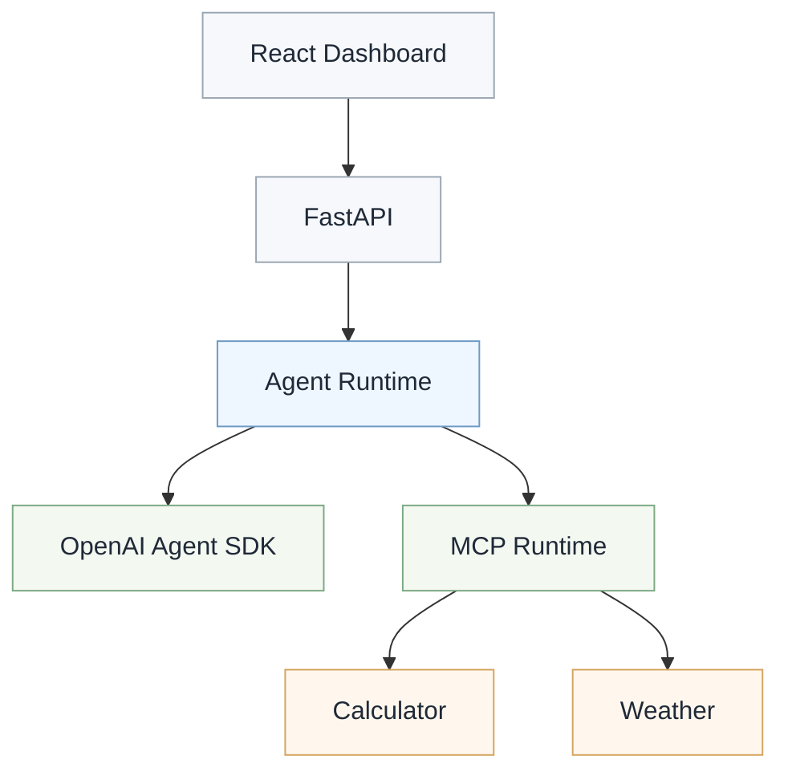

```text
React Dashboard
    │
    ▼
FastAPI
    │
    ▼
Agent Runtime
    ├── OpenAI Agent SDK (model access)
    └── MCP Runtime
            ├── Calculator
            └── Weather
```

Session 3 introduces a provider interface because learners can now ask what happens when the enterprise runs on AWS:

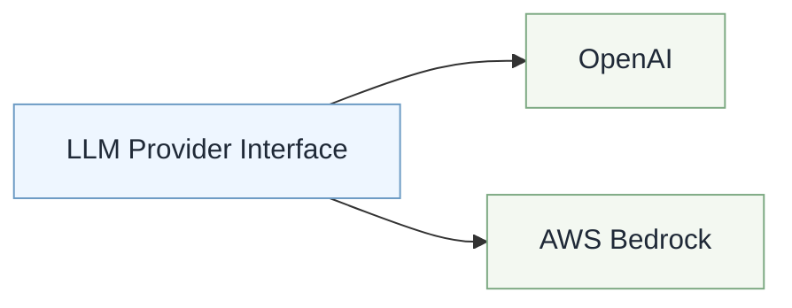

```text
LLM Provider Interface
    │
    ├── OpenAI
    └── AWS Bedrock
```

That interface should stay tiny: accept messages and tool context, call the selected provider, and return a response. It should not route, cache, retry, meter cost, or hide failure policy.

The architecture discussion compares the two provider models explicitly:

| OpenAI | AWS Bedrock |
| ------ | ----------- |
| Direct API | Managed AI platform |
| API key | IAM |
| One provider | Many foundation models |
| Public API | AWS ecosystem |

An optional Azure OpenAI provider extension can follow Session 3. It reinforces the Open/Closed Principle without stealing focus from Context Engineering:

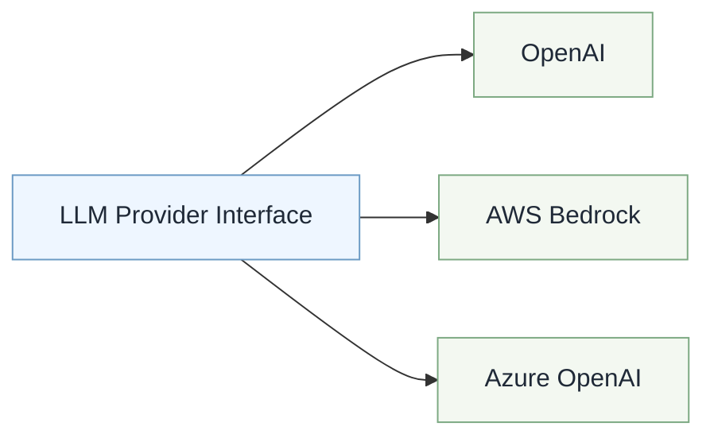

```text
LLM Provider Interface
    │
    ├── OpenAI
    ├── AWS Bedrock
    └── Azure OpenAI
```

The interface remains unchanged; Azure OpenAI adds enterprise Azure concepts such as Azure AI Foundry or Azure OpenAI resources, deployment names versus model names, regional deployments, enterprise networking, and future Entra ID integration.

Phase II introduces the full Model Gateway when provider selection becomes a platform concern:

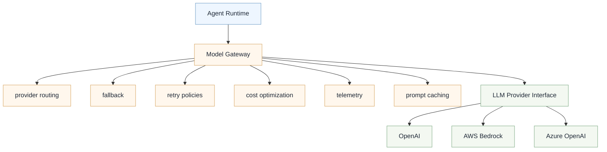

```text
Agent Runtime
    │
    ▼
Model Gateway
    │
    ├── provider routing
    ├── fallback
    ├── retry policies
    ├── cost optimization
    ├── telemetry
    ├── prompt caching
    └── LLM Provider Interface
        ├── OpenAI
        ├── AWS Bedrock
        └── Azure OpenAI
```

The Gateway sits above the Provider Interface; it does not replace it. Provider implementations answer "How do I call this vendor?" The Gateway answers "Which provider should I use, and why?"

### Spike-001 — provider SDK compatibility

Before locking the Session 3 implementation, run a technical spike to verify that the OpenAI Agent SDK can cleanly support OpenAI and AWS Bedrock within one agent runtime, then verify Azure OpenAI as the provider-extension path. If provider-specific integration differs, document the adapter approach while preserving the public architecture and learning objective: one provider interface, same agent and tools.

Spike-001 is decision-producing:

- If OpenAI + AWS Bedrock succeeds, use that pair in the live Session 3 curriculum.
- If Azure OpenAI succeeds, document it as the optional provider extension that demonstrates Open/Closed Principle.
- If a provider reveals SDK limitations, keep the provider interface and document the required adapter approach without changing the live Session 3 learning goal.

### Final architecture vision

By the end of the full curriculum, the same application has evolved into a production-grade AI system:

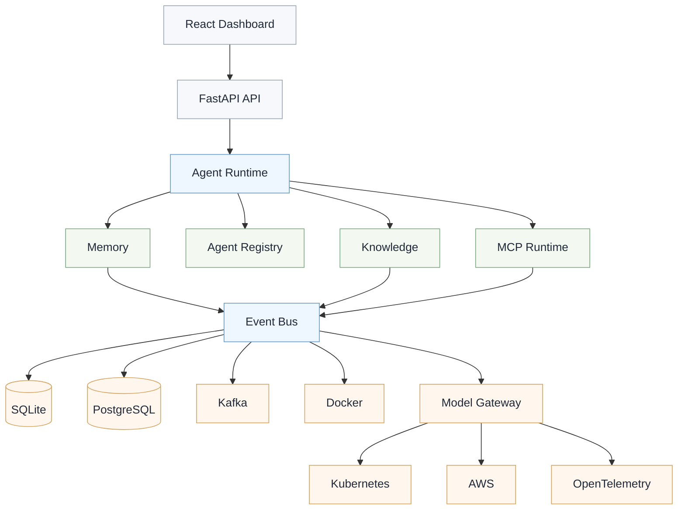

```text
React Dashboard
    │
    ▼
FastAPI API
    │
    ▼
Agent Runtime
    │
    ├──────────────┐
    ▼              ▼
Memory          Agent Registry
    │              │
    ▼              ▼
Knowledge       MCP Runtime
    │              │
    ├──────────────┘
    ▼
Event Bus
    │
    ▼
SQLite → PostgreSQL
Kafka
Docker
Model Gateway
Kubernetes
AWS
OpenTelemetry
```

The provider interface is a Session 3 teaching tool because it solves a cloud-provider independence problem learners can now see. The Azure OpenAI extension proves the interface is open for extension and closed for modification. The Model Gateway is a Phase II platform tool because it solves routing, resilience, telemetry, cost, caching, and policy concerns that are not needed in Phase I.

---

## Future Sessions (Backlog)

The following topics are intentionally excluded from the Phase I–II roadmap. They may become future Swamy's Tech Skills Academy sessions based on community interest.

| Topic | Description |
| ------ | ----------- |
| Advanced MCP Server Design | Building enterprise-grade MCP servers, authentication, authorization, versioning, and reusable tool libraries. |
| Human-in-the-Loop Agents | Approval workflows, human checkpoints, escalation, and collaborative decision making. |
| Advanced Human Evaluation | Expert review workflows, rubric calibration, and qualitative evaluation processes. |
| Agent Product Management | Requirements, user research, adoption, and operating-model design for agent products. |

The backlog should contain only topics that are not already planned in the Phase I–II roadmap.

---

## 11. What each session adds (code)

Paths are relative to `src/`. You **extend** existing modules; you do not create new top-level app folders.

### Session 1

```text
frontend/
    pages/HomePage.tsx              # / — maturity ladder + CTAs
    pages/Level1DemoPage.tsx        # /demo/level-1
    pages/Level2DashboardPage.tsx   # /demo/level-2 — Agent Dashboard panels
    components/Layout.tsx           # shared nav (react-router-dom)
backend/
    app/api/chat.py                 # POST /api/chat — Level 2
    app/api/llm.py                  # POST /api/llm — Level 1
    app/agent_runtime/agent.py      # Proxy Agent runtime
    app/agent_runtime/direct_llm.py # Direct LLM path (no events, no MCP)
    app/agent_runtime/models.py     # DecisionEvent, ChatResponse, LlmResponse, HealthResponse
mcp-server/                         # calculator.py, weather.py
tests/                              # MCP unit tests + API contract tests
```

**Opening demo:** `/demo/level-1` → ask `What is 15 * 23?` (text only). `/demo/level-2` → same prompt; watch `calculate` in the Decision Timeline.

**Dashboard demo:** ask `2 + 5 * 18`, watch the Decision Timeline show intent, tool selection, MCP invocation, and final response. Then ask for weather and show the same agent loop with a different tool.

**Out of scope for Session 1:** provider abstraction, Azure OpenAI, AWS Bedrock, persistent memory, vector databases, multi-agent orchestration, authentication, production deployment, gateway routing, retries, caching, telemetry, fallback, and cost optimization.

### Session 2

```text
backend/app/agent_runtime/     # same package — additive files only
    + conversation.py
backend/app/persistence/
    + sqlite_store.py
frontend/src/components/
    ConversationPanel.tsx
mcp-server/tools/
    # reorganized modules, error handling, timeout patterns
```

**Killer demo:** Ask a weather question, then a follow-up with no city named — SQLite-backed conversation state preserves the session. Streaming fills the Final Response panel token-by-token.

### Session 3

```text
backend/app/agent_runtime/
    + llm/
        provider.py
        openai_provider.py
        bedrock_provider.py
frontend/src/components/
    ProviderSelector.tsx
```

**Killer demo:** Run the same calculator prompt through OpenAI and AWS Bedrock. The provider selector and Current Model panel change, but the agent and MCP tools do not. The architecture discussion highlights API key vs IAM, direct API vs managed platform, and one provider vs many foundation models.

**Bedrock model note:** use the validated Bedrock-supported model from `.env.example` for the live demo. The architecture discussion can mention Claude via Bedrock or another approved foundation model as the same provider implementation with a different model ID.

**Provider extension:** Add `azure_openai_provider.py` as an optional Session 3 extension or take-home lab. The Provider Interface remains unchanged; only a new implementation and configuration are added.

### Session 4

```text
backend/app/agent_runtime/
    + context_window.py
    + context_builder.py
    + context_compression.py
frontend/src/components/
    ContextPanel.tsx
```

**Killer demo:** Have a long conversation that exceeds a small token budget. The application decides what to send to the LLM through sliding-window context, prompt assembly, and compression, while the dashboard shows what was included, summarized, or dropped.

### Session 5

```text
backend/app/rag/
    embedding.py
    vector_store.py
    retriever.py
mcp-server/tools/
    knowledge.py
data/corpus/                   # local docs for RAG demo
```

**Vector DB runtime (Sessions 5–6):** use an **embedded, in-process** store (Chroma persistent mode or SQLite-vec) inside the backend process — no separate container or `docker-compose` service until Session 7 formalizes the full runtime. Attendees should not hunt for a vector DB process for two sessions.

**Vector store migration path:** Phase I uses embedded Chroma or SQLite-vec for a simple local demo. Phase II moves toward PostgreSQL with `pgvector` when Session 10 introduces distributed persistence. This mirrors a common production path: local vector store first, relational persistence with vector search later.

**Killer demo:** Decision Timeline shows `search_docs()` selected over weather/calculator for a knowledge question — retrieval is just another tool in the registry.

### Session 6

```text
backend/app/agents/
    planner.py
    weather_agent.py
    math_agent.py
    knowledge_agent.py
    coordinator.py
```

**Killer demo:** One request delegated to two specialists; Agent Registry shows which sub-agent is active.

### Session 7

```text
backend/app/
    observability/       # logging, health checks, basic traces
.github/workflows/     # deploy pipeline + smoke-test stage
docker-compose.yml     # local production-like run
tests/smoke/           # health, chat round-trip, tool happy path
tools/load/            # optional: hey script or locust file for demo
```

**Killer demo:** The same local app runs through Docker, passes GitHub Actions, exposes health checks, and shows structured logs and basic traces while staying green on the smoke suite.

**Load mechanism (pinned for the room):** add a **"Fire 10 requests"** control on the Agent Dashboard (or run `hey -n 10 -c 2 http://localhost:8000/api/chat` from `tools/load/`) so concurrent traffic is reproducible in 45 minutes — no improvising under load live.

### Session 8

```text
backend/app/
    evals/               # eval harness, golden datasets
    guardrails/          # rate limiting, policy middleware
tests/evals/             # regression cases wired into CI
```

**Killer demo:** Intentionally degrade a prompt, run evals live, watch CI catch the failure.

### Session 9

Assemble a pre-selected capstone scenario using the full stack. See **§16 Capstone logistics**.

### Phase II infrastructure teaching model

Phase II infrastructure should be mostly pre-built. Attendees should understand why the infrastructure exists, how it is configured, how it changes runtime behavior, and how to observe it. They should not spend live session time typing YAML, Helm charts, Terraform, or Kubernetes manifests from scratch.

Pre-build infrastructure artifacts such as `compose/`, `helm/`, `k8s/`, `terraform/`, and provider-specific deployment templates where useful. Use live time for configuration walkthroughs, failure modes, scaling behavior, observability, and trade-offs.

---

## 12. Versioning & branching

Canonical home for detailed versioning policy is [14-versioning-branching.md](./14-versioning-branching.md).

This master plan keeps only the governing summary:

1. `main` tracks the latest completed session.
2. Each session uses two annotated tags: `vN.0-sessionN-start` and `vN.0-session-slug`.
3. Each completed session publishes a GitHub Release tied to the milestone tag.
4. Presenter safety checkpoints use `session-N-live-start` and are distinct from curriculum milestones.

For the full tag matrix, release workflow commands, attendee replay flow, and anti-patterns, use [14-versioning-branching.md](./14-versioning-branching.md). For a copy-paste release runbook and shipping ledger, use [16-releases.md](./16-releases.md).

---

## 13. Developer Setup — prerequisites & one-time setup

**Developer Setup** is not a club meeting — it is the one-time environment setup attendees complete **before Session 1**. Canonical home: [03-getting-started.md](./03-getting-started.md). This section summarizes prerequisites for the master plan; follow the getting-started guide for runnable commands.

### Required tooling

| Tool | Version | Purpose |
| ---- | ------- | ------- |
| Python | 3.13+ | Backend, MCP server |
| Node.js | 20 LTS | Frontend, markdown lint |
| [uv](https://docs.astral.sh/uv/) | latest | Python deps (`src/backend`, `src/mcp-server`) |
| Git | 2.x | Clone, tags, checkout |

### API keys & accounts

| Key | Needed from | Used in |
| --- | ----------- | ------- |
| `OPENAI_API_KEY` | Session 1 | OpenAI provider |
| AWS Bedrock credentials | Session 3 core path | AWS Bedrock provider |
| Azure OpenAI endpoint / key / deployment | Optional Session 3 extension | Azure OpenAI provider |
| `OPENWEATHER_API_KEY` (or equivalent) | Session 1 | Weather MCP tool |
| Embedding provider key | Session 5 | RAG embeddings (OpenAI or chosen provider) |
| Vector DB | Session 5 | Local Chroma/SQLite-vec for club demos (no cloud account required initially) |

Copy `.env.example` → `.env` and fill values locally. **Never commit `.env`.**

### One-time clone & verify

```powershell
git clone https://github.com/vishipayyallore/agentic-engineering-in-practice.git
cd agentic-engineering-in-practice

# From repository root (Session 1 implemented):
uv sync --all-groups
uv run pytest src/backend/tests src/mcp-server/tests -q
cd src/frontend && npm ci && npm run build
```

### Pre-session checklist (send to attendees)

- [ ] Python 3.13, Node 20, uv installed
- [ ] Repo cloned; on `main` or target session tag
- [ ] `.env` configured from `.env.example`
- [ ] All three services start without errors

---

## 14. Documentation plan

```text
docs/
├── ADRs/
│   ├── ADR-001-single-codebase.md
│   ├── ADR-002-git-tags.md
│   ├── ADR-003-dashboard.md
│   ├── ADR-004-event-contract.md
│   ├── ADR-005-provider-before-gateway.md
│   ├── ADR-006-aspire-for-microsoft-orchestration.md
│   ├── ADR-007-demo-routing-level1-level2.md
│   └── ADR-008-product-organization-publishing.md
├── co-architect-operating-guidance.md
├── spikes/
│   ├── SPIKE-001-provider-sdk-compatibility.md
│   └── SPIKE-002-personal-deploy-after-session.md
├── 01-repository-structure.md
├── 02-master-plan.md              # this document
├── 03-getting-started.md          # Developer Setup — prerequisites (§13)
├── 04-introduction.md
├── 05-ai-agents.md
├── 06-openai-agent-sdk.md
├── 07-mcp.md
├── 08-tool-calling.md
├── 09-context-engineering.md
├── 10-rag.md
├── 11-multi-agent.md
├── 12-production.md
├── 13-observability-dashboard.md  # Agent Dashboard, Decision Timeline, Tool Registry — all sessions link here
├── 14-versioning-branching.md   # Git tag/branch workflow for the 15-session curriculum
├── 15-evaluation-guardrails.md
├── 16-releases.md               # Tag + GitHub Release command track + ledger
├── agent-subagents.md
├── agent-skills.md
├── agent-governance-recovery.md
└── architecture/
    ├── 01-context.md              # Presentation view: audience, system purpose, external actors
    ├── 02-container.md            # Container view: frontend, backend, MCP server, external services
    ├── 03-components.md           # Component view: backend packages and major frontend panels
    ├── 04-sequence.md             # Request flow and tool-calling sequence diagrams
    ├── 05-deployment.md           # Production deployment view introduced in Session 7
    └── demo-1-stack.md            # Demo 1 file-level stack map
```

Session-specific walkthroughs and slides live under `presentation/demo-0N/`. Each session updates the relevant topic doc, links to `13-observability-dashboard.md` when touching the dashboard contract, and updates the architecture diagram set when the system shape changes. Follow [Documentation governance](#documentation-governance) — do not duplicate canonical specs in presentation READMEs.

---

## 15. Technology stack

| Layer | Technologies |
| ----- | ------------ |
| **Frontend** | React, TypeScript, Vite, Tailwind CSS |
| **Backend** | Python 3.13, FastAPI, Pydantic, OpenAI Agent SDK, Azure OpenAI, AWS Bedrock SDK |
| **Tools** | Model Context Protocol (MCP), FastMCP |
| **Packaging** | `uv` (Python), `npm` (frontend) |

---

## 16. Capstone logistics (Session 9)

A 45-minute session cannot afford live scenario selection.

| When | Action |
| ---- | ------ |
| **After Session 8** | Send a poll with 3–4 pre-vetted scenarios (e.g. IT helpdesk bot, sales research assistant, internal policy Q&A) |
| **1 week before Session 9** | Close poll; announce winning scenario and share a one-page requirements brief |
| **Session 9 (0–5 min)** | Recap scenario and architecture map — no bikeshedding |
| **Session 9 (5–40 min)** | Live assembly using existing modules |
| **Session 9 (40–45 min)** | Demo + tag `v9.0-local-capstone` |

The capstone **configures and composes** existing pieces; it does not greenfield a new architecture.

---

## 17. Learning outcomes

By the end of the series, participants should understand how to:

- Build AI agents from first principles
- Integrate external tools via MCP
- Add provider abstraction, streaming, conversation state, and session management
- Design application state, LLM context, and knowledge retrieval as separate concerns
- Ground agents with enterprise knowledge (RAG)
- Design and orchestrate multiple agents
- Observe, secure, test, and deploy agent systems
- Evaluate agent quality and apply guardrails
- Deliver a production-inspired agentic application end-to-end

---

## 18. Repository maturity checklist

The committed layout is:

- ✅ Simple enough for Session 1
- ✅ Professional and easy to navigate
- ✅ Scales through the 15-session curriculum without restructuring
- ✅ Familiar to enterprise engineers (`src/frontend`, `src/backend`, `src/mcp-server`)
- ✅ Room to grow into Sessions 7–9 without a rewrite
- ✅ Versioning model supports late joiners and session replay
- ✅ Decision Timeline payload + events stable from Session 1
- ✅ `agent_runtime/` locked from first commit — tag diffs stay additive
- ✅ Level 1 Direct LLM demo at `/demo/level-1` (`POST /api/llm`) — thin baseline, separate from Agent Runtime
- ✅ Level 2 Agent Dashboard at `/demo/level-2` — Session 1 deliverable and Git tag scope
- ✅ Tiny LLM Provider Interface introduced in Session 3 because provider lock-in is now visible
- ✅ Full Model Gateway deferred to Phase II — routing, fallback, retries, caching, telemetry, cost, and policy appear only when platform concerns make them meaningful
- ✅ Spike-001 protects the provider design by validating SDK compatibility before Session 3 becomes contractual

---

## 19. Next step

**Session 1 is implemented** in `src/` — Home + Level 1 + Level 2 routes, `agent_runtime/`, MCP calculator and weather tools, Decision Timeline events, and Demo 1 topic guides under `docs/`.

**Immediate actions:**

1. Tag and release `v1.0-build-your-first-agent` when the July session milestone is formally closed.
2. Teach Demo 1 from [presentation/demo-01/README.md](../presentation/demo-01/README.md).
3. Prepare Session 2 assets (`presentation/demo-02/`, conversation state, streaming) per the Session 2 row in [§11](#11-what-each-session-adds-code).
4. Complete [SPIKE-001](./spikes/SPIKE-001-provider-sdk-compatibility.md) before Session 3 locks the provider interface.

---

## Appendix A — Evolving repository structure

File trees after each session (`+` = new or significantly expanded). Use with `git checkout <tag>` to code along at any point.

### After Session 1 — `v1.0-build-your-first-agent`

```text
src/
├── frontend/
│   └── src/
│       ├── pages/               # HomePage, Level1DemoPage, Level2DashboardPage
│       ├── components/          # Layout, PromptPanel, DecisionTimeline, ToolRegistry, …
│       ├── hooks/               # useChat, useDirectLlm
│       ├── services/            # api.ts (sendChat, sendDirectLlm, fetchHealth)
│       └── types/               # decision-event.ts
├── backend/
│   └── app/
│       ├── api/
│       │   ├── chat.py          # POST /api/chat — Level 2
│       │   └── llm.py           # POST /api/llm — Level 1
│       ├── agent_runtime/       # final name from Session 1 — no later rename
│       │   ├── agent.py
│       │   ├── direct_llm.py
│       │   ├── instructions.py
│       │   ├── models.py        # AgentMaturityLevel, DecisionEvent, response models
│       │   ├── event_bus.py
│       ├── config.py
│       └── main.py
├── backend/tests/
│   ├── test_api.py
│   ├── test_event_bus.py
│   └── test_maturity.py
└── mcp-server/
    ├── server.py
    ├── tests/
    │   ├── test_calculator.py
    │   └── test_weather.py
    └── tools/
        ├── calculator.py
        └── weather.py
```

### After Session 2 — `v2.0-stateful-agents`

```text
src/backend/app/agent_runtime/
    + conversation.py
src/backend/app/api/
    + sessions.py
src/backend/tests/
    + test_conversation.py
    + test_sqlite_store.py
src/frontend/src/components/
    + ConversationPanel.tsx
src/frontend/src/hooks/
    + useChatStream.ts
```

### After Session 3 — `v3.0-multi-provider-agents`

```text
src/backend/app/agent_runtime/
    + llm/
        provider.py
        openai_provider.py
        bedrock_provider.py
src/backend/tests/
    + test_provider_contract.py
src/frontend/src/components/
    + ProviderSelector.tsx
```

### Optional Provider Extension — Azure OpenAI

```text
src/backend/app/agent_runtime/llm/
    + azure_openai_provider.py
```

### After Session 4 — `v4.0-context-engineering`

```text
src/backend/app/agent_runtime/
    + context_window.py
    + context_builder.py
    + context_compression.py
src/backend/tests/
    + test_context_builder.py
    + test_context_compression.py
src/frontend/src/components/
    + ContextPanel.tsx
```

### After Session 5 — `v5.0-knowledge-driven-agents`

```text
src/backend/app/rag/
    + embedding.py
    + vector_store.py
    + retriever.py
src/backend/tests/
    + test_retriever.py
src/mcp-server/tools/
    + knowledge.py
src/mcp-server/tests/
    + test_knowledge.py
src/frontend/src/components/
    + RetrievedDocuments.tsx
data/
    + corpus/                    # local docs for RAG demo
```

### After Session 6 — `v6.0-multi-agent-engineering`

```text
src/backend/app/agents/
    + planner.py
    + weather_agent.py
    + math_agent.py
    + knowledge_agent.py
    + coordinator.py
src/backend/tests/
    + test_planner.py
    + test_coordinator.py
src/frontend/src/components/
    ~ ToolRegistry → AgentRegistry  # same panel, new semantics
```

### After Session 7 — `v7.0-production-foundations`

```text
src/backend/app/
    + observability/
.github/workflows/
    + ci-deploy.yml               # smoke tests + deploy
+ docker-compose.yml
tests/smoke/
    + test_health.py
    + test_chat_roundtrip.py
```

### After Session 8 — `v8.0-evaluation-guardrails`

```text
src/backend/app/
    + evals/
    + guardrails/
tests/evals/
    + golden_prompts.json
    + test_agent_quality.py
.github/workflows/
    ~ ci-deploy.yml               # + eval stage
```

### After Session 9 — `v9.0-local-capstone`

```text
src/backend/app/capstone/         # scenario-specific config only
    + scenario_config.py
presentation/demo-09/
```

### After Session 10 — `v10.0-distributed-persistence`

```text
src/backend/app/persistence/
    + postgres_store.py
    + migrations/
infra/local/
    + postgres-compose.yml
```

### After Session 11 — `v11.0-event-driven-ai`

```text
src/backend/app/events/
    + producer.py
    + consumer.py
    + schemas.py
src/backend/app/workers/
    + background_tasks.py
infra/local/
    + kafka-compose.yml
```

### After Session 12 — `v12.0-cloud-native-ai`

```text
src/backend/app/observability/
    + otel.py
src/backend/app/model_gateway/
    + gateway.py
    + routing.py
    + policy.py
infra/aspire/
    + README.md
    + AppHost/                  # optional .NET Aspire orchestration sample
```

### After Session 13 — `v13.0-kubernetes-cloud`

```text
infra/kubernetes/
    + backend.yaml
    + frontend.yaml
    + mcp-server.yaml
infra/cloud/
    + aws/
    + azure/
```

### After Session 14 — `v14.0-enterprise-operations`

```text
src/backend/app/security/
    + identity.py
    + rbac.py
docs/operations/
    + governance.md
    + cost-management.md
    + runbook.md
```

### After Session 15 — `v15.0-enterprise-capstone`

```text
docs/capstone/
    + enterprise-deployment.md
presentation/demo-15/
```

No new top-level `src/` siblings are introduced after Session 1 — only modules grow inside the existing tree.
