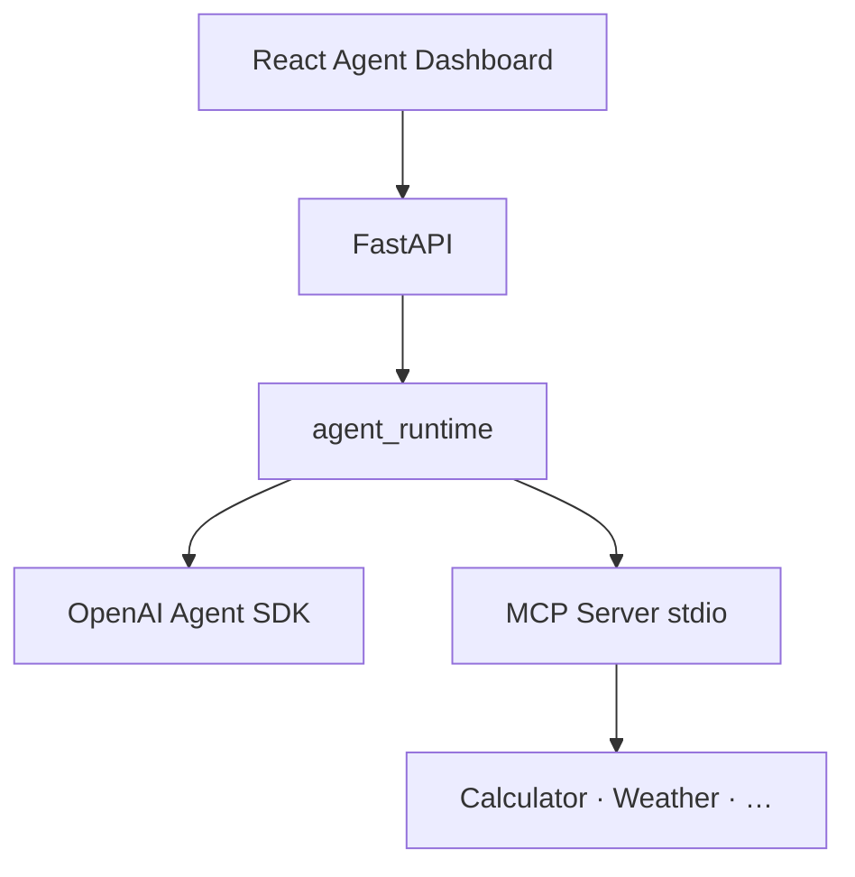

# Introduction — Agentic Engineering in Practice

> **Audience:** Software engineers new to AI agents  
> **Status:** Core series overview (Demo 1 runnable; future sessions planned)

This repository teaches **agentic engineering** — building software where an AI model **reasons about tasks**, **selects tools**, and **acts on external systems**, not just returns chat text.

## What makes this different from a chatbot tutorial

| Chatbot pattern | Agent pattern (this repo) |
| --------------- | ------------------------- |
| User message → model text | User message → **decision path** → optional tool calls → synthesized answer |
| Hidden reasoning | **Decision Timeline** of structured events |
| One UI panel | **Agent Dashboard** (prompt, timeline, tools, execution, response) |
| Disposable demos | **One evolving app** tagged at each milestone (`v1.0-build-your-first-agent` … `v15.0-enterprise-capstone`) |

## Learning journey

This is the Phase I learning path. Phase II continues with distributed persistence, event-driven AI, cloud-native orchestration, Kubernetes/cloud deployment, enterprise operations, and the enterprise capstone in Sessions 10–15.

```text
Single Agent (Session 1)
      │
      ▼
Stateful Agent (Session 2)
      │
      ▼
Multi-Provider Agent (Session 3)
      │
      ▼
Context Engineering (Session 4)
      │
      ▼
Knowledge-Aware Agent (Session 5)
      │
      ▼
Multi-Agent System (Session 6)
      │
      ▼
Production System (Session 7)
      │
      ▼
Evaluation & Guardrails (Session 8)
      │
      ▼
Local Capstone (Session 9)
      │
      ▼
Phase II Platform Engineering (Sessions 10-15)
```

See [02-master-plan.md §10](./02-master-plan.md#10-curriculum-roadmap) for the full roadmap.

## Architecture at a glance



ASCII fallback:

```text
React Agent Dashboard
      |
      v
FastAPI
      |
      v
agent_runtime
   |          |
   v          v
OpenAI SDK   MCP Server stdio
           |
           v
      Calculator / Weather / ...
```

**Plain English:** The dashboard sends a prompt to FastAPI. The **agent runtime** uses the OpenAI Agent SDK directly in Demo 1, while tools stay isolated behind the **MCP server** over stdio — the same plug shape for calculator, weather, or later knowledge search.

Detailed stack notes: [architecture/demo-1-stack.md](./architecture/demo-1-stack.md)

## How to use the documentation

| Doc | When to read |
| --- | ------------ |
| [03-getting-started.md](./03-getting-started.md) | Before your first run (Developer Setup) |
| [05-ai-agents.md](./05-ai-agents.md) | Conceptual foundation |
| [06-openai-agent-sdk.md](./06-openai-agent-sdk.md) | How the backend runs the agent |
| [07-mcp.md](./07-mcp.md) | How tools are exposed |
| [08-tool-calling.md](./08-tool-calling.md) | End-to-end tool flow (Demo 1) |
| [13-observability-dashboard.md](./13-observability-dashboard.md) | Dashboard and DecisionEvent contract |
| [02-master-plan.md](./02-master-plan.md) | Full series plan and contracts |

Session walkthroughs live under `presentation/demo-0N/`. Start with [presentation/demo-01/README.md](../presentation/demo-01/README.md) for the July session script.

## Business scenarios this series prepares you for

- **IT support assistant** — answers questions, calls ticket APIs, assembles the right LLM context, and looks up runbooks
- **Sales research agent** — gathers company news, weather for travel, calculates pricing (multi-tool Demo 1 pattern)
- **Internal policy bot** — retrieves grounded documents with audit trail (Decision Timeline)

Each demo adds one production-inspired capability while keeping the same codebase.

## What you will build in Demo 1

Runnable today:

- React **Agent Dashboard** at `http://localhost:5173` — Home plus maturity routes
- **Level 1** at `/demo/level-1` via `POST /api/llm` (direct LLM contrast; no Decision Timeline)
- **Level 2** at `/demo/level-2` via `POST /api/chat` (Agent Runtime + MCP + Decision Timeline)
- MCP tools: `calculate`, `get_weather`
- Shared **DecisionEvent** stream on Level 2 (backend Pydantic ↔ frontend TypeScript)

Try: `What is 15 * 23?` on Level 1 (text only), then the same on Level 2 (watch `calculate` in the Decision Timeline). Setup: [03-getting-started.md](./03-getting-started.md). Maturity framing: [05-ai-agents.md](./05-ai-agents.md).

## Next steps

1. Complete [03-getting-started.md](./03-getting-started.md)
2. Read [05-ai-agents.md](./05-ai-agents.md) for vocabulary
3. Follow [presentation/demo-01](../presentation/demo-01/README.md) for the live session narrative
