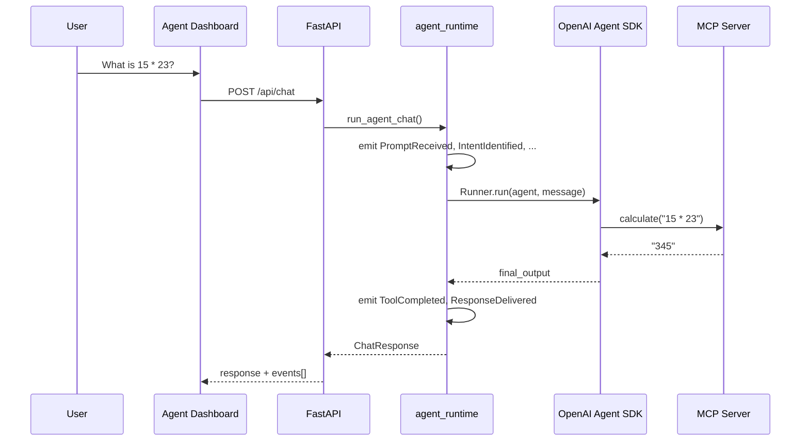

# Tool Calling

> **Demo scope:** Fully implemented in Demo 1 — calculator and weather killer demos.

**Tool calling** is the pattern where the agent **selects an external function**, passes structured arguments, and **uses the result** in its final answer.

## End-to-end flow



ASCII fallback:

```text
User
  -> Agent Dashboard: What is 15 * 23?
  -> FastAPI: POST /api/chat
  -> agent_runtime: run_agent_chat()
  -> agent_runtime: emit PromptReceived / IntentIdentified / ...
  -> OpenAI Agent SDK: Runner.run(agent, message)
  -> MCP Server: calculate("15 * 23")
  <- MCP Server: "345"
  <- OpenAI Agent SDK: final_output
  -> agent_runtime: emit ToolCompleted / ResponseDelivered
  <- FastAPI: ChatResponse
  <- Agent Dashboard: response + events[]
```

## Decision Timeline for a tool call

Eight events for a typical Demo 1 tool prompt:

| # | Event | Demo 1 example |
| - | ----- | -------------- |
| 1 | `PromptReceived` | `"What is 15 * 23?"` |
| 2 | `IntentIdentified` | `metadata.intent = "arithmetic"` |
| 3 | `ExecutionPlanCreated` | `metadata.plan = "use_tools"` |
| 4 | `ToolSelected` | `tool = "calculate"` |
| 5 | `ToolInvoked` | `tool = "calculate"`, `params={"query": "<user message>"}` (Demo 1 teaching shortcut) |
| 6 | `ToolCompleted` | `result` is the final agent answer text (not the isolated MCP payload) |
| 7 | `ResponseSynthesized` | agent composes answer |
| 8 | `ResponseDelivered` | final text to UI |

Full contract: [02-master-plan.md §7](./02-master-plan.md#7-decision-timeline-backend--ui-contract) and [13-observability-dashboard.md](./13-observability-dashboard.md).

**Demo 1 teaching note:** `ToolSelected` / `ToolInvoked` are emitted from keyword heuristics in `agent_runtime/agent.py` *before* `Runner.run()`, so the room sees a full narrative on the first prompt. Later sessions can tighten this to SDK/tool instrumentation. See [13-observability-dashboard.md — Demo 1 implementation notes](./13-observability-dashboard.md#demo-1-implementation-notes-session-1).

## Killer demo 1 — Calculator

**Prompt:** `What is 15 * 23?`

**Expected:**

- Final response contains **345**
- Tool Registry: `calculate` progresses Available → Selected → Running → Success
- API smoke test:

```powershell
$body = '{"message":"What is 15 * 23?"}'
$r = Invoke-RestMethod -Uri "http://127.0.0.1:8000/api/chat" `
  -Method POST -ContentType "application/json" -Body $body
$r.response   # expect answer containing 345
$r.events.Count  # expect 8
```

## Killer demo 2 — Weather

**Prompt:** `What's the weather in Seattle?`

**Expected:**

- `get_weather` in Tool Registry (not `calculate`)
- Live data when `OPENWEATHER_API_KEY` is set; demo fallback otherwise
- Same 8-event timeline shape

**Business grounding:** A field-service agent might combine weather + travel time tools before recommending a dispatch window — same multi-step pattern, different tools.

## No-tool path

**Prompt:** `What is an AI agent?`

**Expected:**

- No `ToolSelected` / `ToolInvoked` / `ToolCompleted`
- Timeline: `PromptReceived` → `IntentIdentified` → `ExecutionPlanCreated` (`direct_response`) → `ResponseSynthesized` → `ResponseDelivered`
- Five events total

## Tool Registry states

UI labels (Font Awesome icons in `ToolRegistry.tsx`):

| Label | State | Driven by |
| ----- | ----- | --------- |
| Available | Idle | Tool registered, not yet used |
| Selected | Chosen | `ToolSelected` |
| Running | In flight | `ToolInvoked` |
| Success | Done | `ToolCompleted` |
| Handled | Recovered failure | `ToolFailedHandled` (defined; not on Demo 1 happy path) |
| Failed | Hard failure | `ToolFailedUnhandled` (Demo 1 UI). `SystemErrorRaised` is timeline/Final Response only |

## Shared types (backend ↔ frontend)

| Layer | Path |
| ----- | ---- |
| Pydantic | `src/backend/app/agent_runtime/models.py` |
| TypeScript | `src/frontend/src/types/decision-event.ts` |
| Emitter | `src/backend/app/agent_runtime/event_bus.py` |

Session 7 tracing will consume the **same event stream** — no redesign.

## Failure modes (Demo 1)

| Symptom | Likely cause |
| ------- | ------------ |
| Missing timeline | Backend not running on port 8000 |
| `MISSING_API_KEY` | `.env` missing `OPENAI_API_KEY` at repo root |
| MCP spawn error | Run `uv sync --all-groups` from repo root |
| Wrong tool | Rephrase prompt; check intent keywords in `agent.py` |

Presenter fixes: [presentation/demo-01/README.md § Troubleshooting](../presentation/demo-01/README.md#troubleshooting-during-the-live-session)

## Related

- [05-ai-agents.md](./05-ai-agents.md) — agent vs chatbot
- [07-mcp.md](./07-mcp.md) — tool implementations
- [03-getting-started.md](./03-getting-started.md) — run the stack locally
