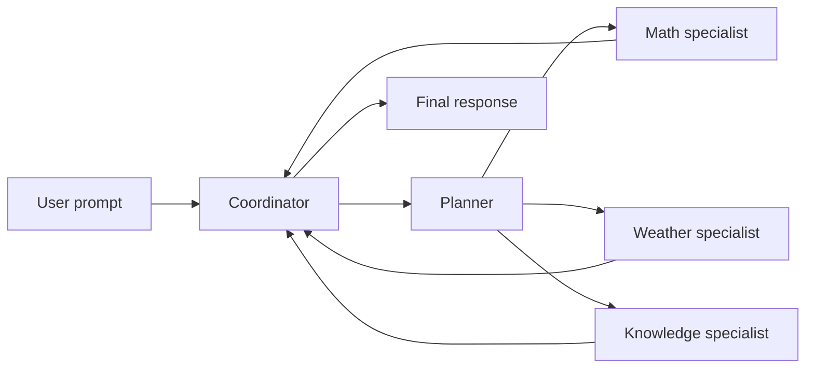

# Multi-Agent Systems

> **Status:** 📅 Planned — Session 6 (`v6.0-multi-agent-engineering`)  
> **Prerequisite:** Session 5 RAG ([10-rag.md](./10-rag.md))

Session 6 introduces **specialist agents** coordinated by a **planner** — how teams scale agentic systems when one generalist model is not enough.

## Plain English

Instead of one agent with every tool, a **coordinator** receives the user goal, a **planner** breaks it into steps, and **specialists** (math, weather, knowledge) handle their slice. The dashboard's **Tool Registry becomes an Agent Registry**.

**Business scenario:** A research workflow — planner decides you need company financials (knowledge agent) and travel weather (weather agent) before synthesizing a briefing.

## Planned roles

| Agent | Responsibility |
| ----- | -------------- |
| **Planner** | Decompose user request into steps |
| **Math specialist** | Calculator-heavy subtasks |
| **Weather specialist** | Location and forecast subtasks |
| **Knowledge specialist** | RAG retrieval subtasks |
| **Coordinator** | Route work, merge results |

## Planned code additions

```text
src/backend/app/agents/
    planner.py
    weather_agent.py
    math_agent.py
    knowledge_agent.py
    coordinator.py
src/frontend/src/components/
    ~ ToolRegistry → AgentRegistry  # same panel, new semantics
```

## Decision Timeline evolution

`DecisionEvent.agent` field (already in the Session 1 contract) identifies **which specialist** emitted an event. Timeline may show interleaved steps from multiple agents before `ResponseDelivered`.

## UI change

| Sessions 1–5 | Session 6 |
| -------- | ------ |
| Tool Registry lists MCP tools | **Agent Registry** lists planner + specialists |
| Tool Execution shows tool params | Shows delegated sub-requests per agent |

Contract reference: [13-observability-dashboard.md](./13-observability-dashboard.md)

## Orchestration diagram (planned)



ASCII fallback:

```text
User prompt
  |
  v
Coordinator
  |
  v
Planner
  |
  v
Math / Weather / Knowledge specialists
  |
  v
Coordinator
  |
  v
Final response
```

## Related

- [05-ai-agents.md](./05-ai-agents.md) — single-agent baseline
- [presentation/demo-06/README.md](../presentation/demo-06/README.md)
- [02-master-plan.md § Curriculum roadmap](./02-master-plan.md#10-curriculum-roadmap)
