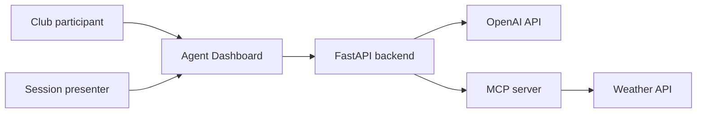

# Architecture Context

> **View:** Presentation context  
> **Scope:** Whole Agentic Engineering in Practice system

This view explains who uses the system and which external systems it touches.



ASCII fallback:

```text
Club participant ----\
                     v
Session presenter -> Agent Dashboard -> FastAPI backend
                                           |       |
                                           v       v
                                      OpenAI API  MCP server
                                                     |
                                                     v
                                                Weather API
```

## Reading the diagram

- Participants and presenters interact with the React Agent Dashboard.
- The dashboard sends prompts to the FastAPI backend.
- The backend runs the Demo 1 agent through the OpenAI Agent SDK.
- Tool access is isolated behind the MCP server.
- External services appear only where a session needs them.

## Session notes

Session 1 keeps the context small: one dashboard, one backend, one OpenAI agent path, one MCP server, and two tools. Later sessions expand the same context without replacing it.
