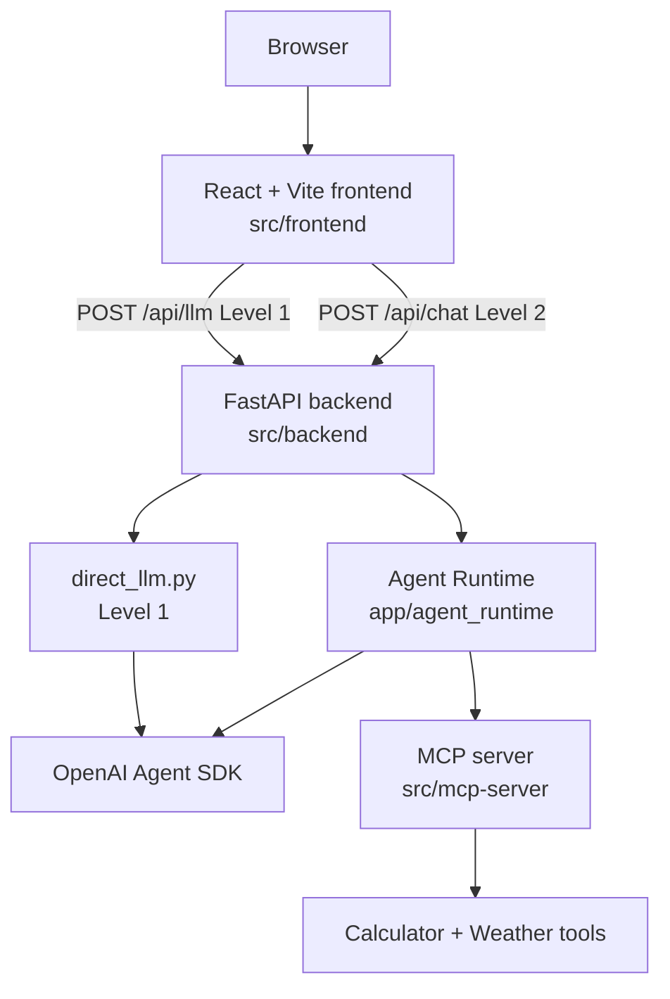

# Container View

> **View:** Runtime containers  
> **Scope:** Frontend, backend, MCP server, and external services



ASCII fallback:

```text
Browser
  |
  v
React + Vite frontend (src/frontend)
  |
  |-- POST /api/llm  (Level 1 → direct_llm.py → OpenAI Agent SDK)
  |-- POST /api/chat (Level 2 → Agent Runtime → SDK + MCP)
  v
FastAPI backend (src/backend)
  |
  ├── Level 1: direct_llm.py → OpenAI Agent SDK (no MCP, no timeline)
  └── Level 2: agent_runtime → OpenAI Agent SDK + MCP server
                                      |
                                      v
                                Calculator + Weather tools
```

## Session 1 containers

| Container | Responsibility |
| --------- | -------------- |
| React frontend | Home + Level 1 + Level 2 routes; Agent Dashboard on Level 2. |
| FastAPI backend | Exposes `GET /health`, `POST /api/llm`, and `POST /api/chat`. |
| Level 1 path | Thin direct-LLM contrast (`direct_llm.py`) — no MCP or Decision Timeline. |
| Agent Runtime | Coordinates prompts, Decision Timeline events, OpenAI Agent SDK calls, and tool execution (Level 2). |
| MCP server | Hosts tool implementations behind the MCP protocol. |

## Session 7 evolution

Session 3 adds the tiny provider interface for OpenAI and AWS Bedrock. Azure OpenAI follows as an optional provider extension. Session 7 hardens production packaging (Docker, deploy CI, formal smoke suites, structured logging, production-grade probes beyond Demo 1's basic `GET /health`). Phase II adds the full Model Gateway.
