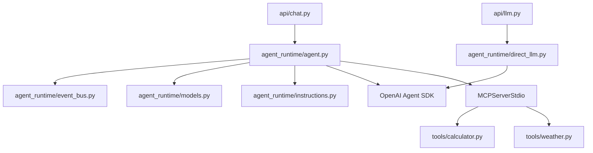

# Component View

> **View:** Backend and dashboard components  
> **Scope:** Demo 1 implementation shape



ASCII fallback:

```text
api/llm.py  → agent_runtime/direct_llm.py → OpenAI Agent SDK
              (Level 1 — no MCP, no Decision Timeline events)

api/chat.py
    |
    v
agent_runtime/agent.py
    |-- agent_runtime/event_bus.py
    |-- agent_runtime/models.py
    |-- agent_runtime/instructions.py
    |-- OpenAI Agent SDK
    +-- MCPServerStdio
            |-- tools/calculator.py
            +-- tools/weather.py
```

## Backend components

| Component | Responsibility |
| --------- | -------------- |
| `api/llm.py` | Level 1 direct LLM path; returns `LlmResponse` (no `events[]`). |
| `api/chat.py` | Level 2 chat requests; returns `ChatResponse` with Decision Timeline events. |
| `agent_runtime/direct_llm.py` | Thin Level 1 runner (SDK call without MCP or timeline). |
| `agent_runtime/agent.py` | Runs the Demo 1 Level 2 agent and coordinates tool usage. |
| `agent_runtime/event_bus.py` | Emits ordered Decision Timeline events. |
| `agent_runtime/models.py` | Defines Pydantic API and event contracts. |
| `mcp-server/tools/` | Implements external capabilities exposed through MCP. |

## Future component growth

- Session 2 adds streaming and conversation state.
- Session 3 adds provider abstraction.
- Session 4 adds context engineering components.
- Session 5 adds RAG components.
- Session 6 adds specialist agents and coordination.
- Session 7 hardens production foundations (Docker, deploy CI, formal smoke suites, structured logging, production-grade probes beyond Demo 1 `GET /health`).
- Phase II adds `model_gateway/` when provider routing becomes a platform concern.
