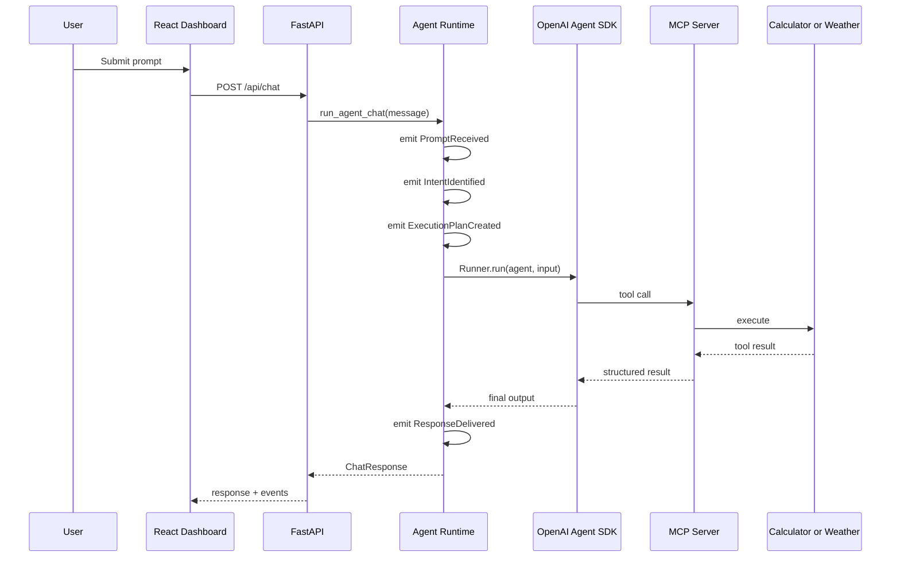

# Sequence View

> **View:** Request and tool-calling flow  
> **Scope:** Demo 1 chat request



ASCII fallback:

```text
User
  -> React Dashboard: Submit prompt
  -> FastAPI: POST /api/chat
  -> Agent Runtime: run_agent_chat(message)
  -> Agent Runtime: emit PromptReceived / IntentIdentified / ExecutionPlanCreated
  -> OpenAI Agent SDK: Runner.run(agent, input)
  -> MCP Server: tool call
  -> Calculator or Weather: execute
  <- MCP Server: tool result
  <- OpenAI Agent SDK: structured result / final output
  -> Agent Runtime: emit ResponseDelivered
  <- FastAPI: ChatResponse
  <- React Dashboard: response + events
```

## Why this matters

The sequence separates three concerns that learners can observe in the UI:

- Agent behavior: intent, plan, response synthesis.
- Tool behavior: selected, invoked, completed, or failed.
- System behavior: request IDs, session IDs, and ordered events.
