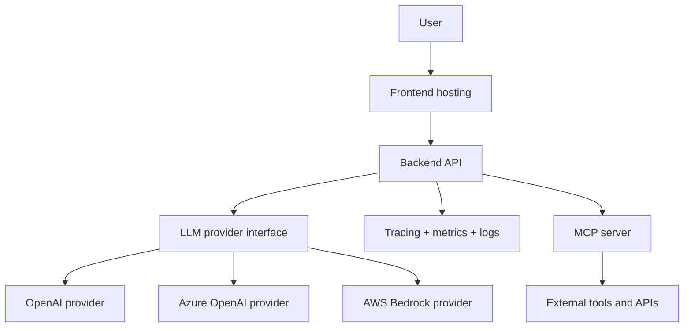

# Deployment View

> **View:** Production deployment direction  
> **Scope:** Introduced in Session 7

Session 1 runs locally with frontend and backend developer processes; the backend spawns the MCP server as needed. Session 7 turns that local stack into a production-inspired deployment.



ASCII fallback:

```text
User
  |
  v
Frontend hosting
  |
  v
Backend API
  |-- LLM provider interface
  |     |-- OpenAI provider
  |     |-- Azure OpenAI provider
  |     +-- AWS Bedrock provider
  |-- MCP server --> External tools and APIs
  +-- Tracing + metrics + logs
```

## Session 7 additions

| Addition | Purpose |
| -------- | ------- |
| Observability | Trace requests, provider calls, tool calls, failures, and latency. |
| Docker / deployment pipeline | Make the stack reproducible outside a developer machine. |

## Teaching note

The Model Gateway is intentionally absent from Session 1 and Session 7. Session 3 introduces the tiny provider interface for OpenAI and AWS Bedrock, with Azure OpenAI as an optional extension. Phase II introduces the gateway when routing, fallback, retries, telemetry, cost, caching, and policy become platform concerns.
