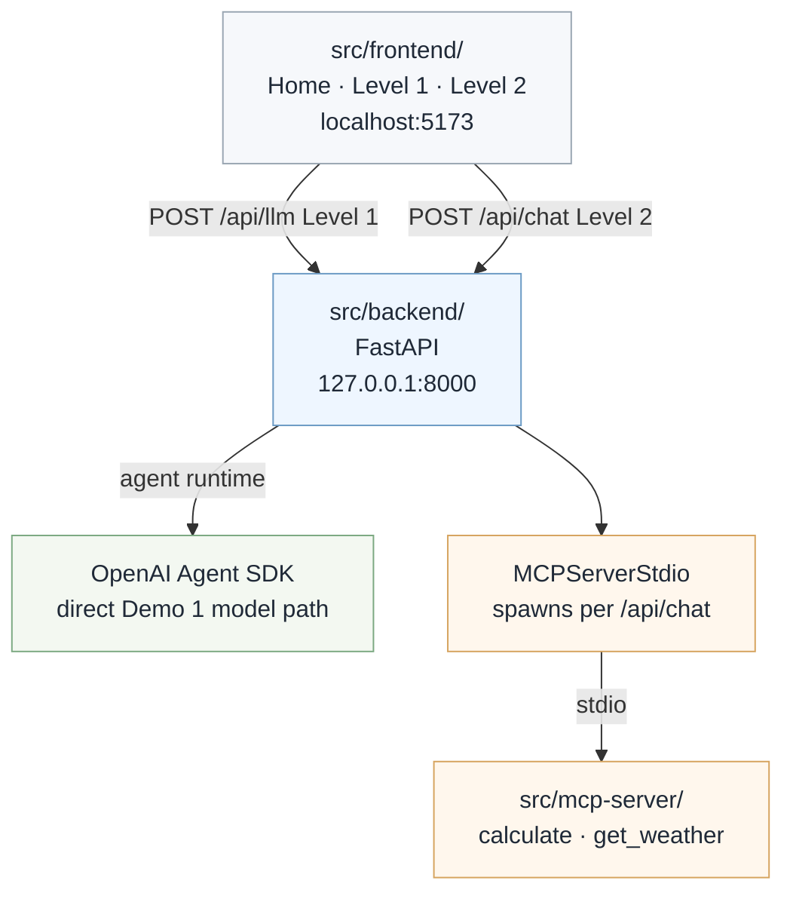

# Demo 1 — Application Stack

> **Status:** Released (Demo 1) — `v1.0-build-your-first-agent`
> **Canonical layout:** [01-repository-structure.md](../01-repository-structure.md)

File-level map of the runnable Demo 1 stack — synthesized from the master plan and current `src/` tree.

## Layer diagram



```text
┌─────────────────────────────────────────────────────────┐
│  src/frontend/          Home + Level 1 + Level 2 routes │
│  localhost:5173         Vite proxy → /api/*, /health    │
└────────────────────────────┬────────────────────────────┘
                             │ POST /api/llm (Level 1)
                             │ POST /api/chat (Level 2)
┌────────────────────────────▼────────────────────────────┐
│  src/backend/           FastAPI                         │
│  127.0.0.1:8000         app/agent_runtime/              │
└────────────────────────────┬────────────────────────────┘
              │ agent runtime
              ├──────────────────────────────────────────┐
              │                                          │
              ▼                                          ▼
┌─────────────────────────────────────────┐ ┌──────────────────────────┐
│  OpenAI Agent SDK                       │ │  MCPServerStdio          │
│  direct Demo 1 model path               │ │  spawns per /api/chat    │
└─────────────────────────────────────────┘ └────────────┬─────────────┘
                                                           │ stdio
┌────────────────────────────▼────────────────────────────┐
│  src/mcp-server/        calculate · get_weather         │
└─────────────────────────────────────────────────────────┘
```

## Frontend (`src/frontend/`)

| Route | Page | API |
| ----- | ---- | --- |
| `/` | `HomePage.tsx` | — |
| `/demo/level-1` | `Level1DemoPage.tsx` | `POST /api/llm` |
| `/demo/level-2` | `Level2DashboardPage.tsx` | `POST /api/chat` |

| Area | Role |
| ---- | ---- |
| `src/pages/` | Home, Level 1 Direct LLM, Level 2 Agent Dashboard |
| `src/components/` | Dashboard panels (`PromptPanel`, `DecisionTimeline`, `ToolRegistry`, `ToolExecution`, `FinalResponse`) |
| `src/hooks/` | `useDirectLlm`, `useChat` |
| `src/services/api.ts` | Calls `/api/llm` and `/api/chat` via Vite proxy |
| `src/types/decision-event.ts` | TypeScript mirror of backend events |

Dev server: `npm run dev` → [http://localhost:5173](http://localhost:5173)

## Backend (`src/backend/`)

| Path | Role |
| ---- | ---- |
| `app/main.py` | FastAPI app, CORS, `GET /health` |
| `app/api/llm.py` | `POST /api/llm` — Level 1 Direct LLM |
| `app/api/chat.py` | `POST /api/chat` — Level 2 Agent Runtime |
| `app/agent_runtime/direct_llm.py` | Level 1 path — no MCP, no events |
| `app/agent_runtime/agent.py` | Level 2 — SDK agent + MCP spawn + event emission |
| `app/agent_runtime/models.py` | `DecisionEvent`, `ChatResponse` |
| `app/agent_runtime/event_bus.py` | Ordered event list per request |
| `app/config.py` | Settings from repo-root `.env` |

Run from repo root:

```powershell
uv run uvicorn app.main:app --app-dir src/backend --reload --port 8000
```

## MCP server (`src/mcp-server/`)

| Path | Role |
| ---- | ---- |
| `server.py` | FastMCP tool registrations |
| `tools/calculator.py` | Safe math evaluation |
| `tools/weather.py` | OpenWeatherMap + demo fallback |

Not started manually in Demo 1 — backend spawns via `MCPServerStdio`.

## Configuration

Repo-root `.env` (see `.env.example`):

| Variable | Required | Purpose |
| -------- | -------- | ------- |
| `OPENAI_API_KEY` | Yes | Demo 1 OpenAI Agent SDK path |
| `OPENWEATHER_API_KEY` | No | Live weather (demo fallback if unset) |
| `OPENAI_MODEL` | No | Model override |

AWS Bedrock settings are reserved for Session 3, when the Provider Pattern is introduced. Azure OpenAI settings are reserved for the optional provider extension after Session 3. The Bedrock example defaults to `qwen.qwen3-coder-480b`.

## API contracts

### Level 1 — `POST /api/llm`

**Request:** `{ "message": "What is 15 * 23?" }`

**Response:** `{ "response": "...", "maturityLevel": 1, "maturityName": "DIRECT_LLM_INTERACTION" }` — no `events[]`

### Level 2 — `POST /api/chat`

**Request:**

```json
{ "message": "What is 15 * 23?", "sessionId": "optional-uuid" }
```

**Response:**

```json
{
  "sessionId": "...",
  "requestId": "...",
  "response": "15 multiplied by 23 is 345.",
  "events": [ /* DecisionEvent[] */ ],
  "maturityLevel": 2,
  "maturityName": "PROXY_AGENT"
}
```

## API contract appendix (code-anchored)

Use this appendix as the Demo 1 source of truth for request and response payloads.

### Source files

- Backend models: `src/backend/app/agent_runtime/models.py`
- Backend routes: `src/backend/app/api/llm.py`, `src/backend/app/api/chat.py`, `src/backend/app/main.py`
- Frontend types: `src/frontend/src/types/decision-event.ts`
- Frontend API client: `src/frontend/src/services/api.ts`

### Endpoints

| Endpoint | Request JSON | Response JSON |
| -------- | ------------ | ------------- |
| `GET /health` | none | `{ status, demo, maturityLevel, maturityName }` |
| `POST /api/llm` | `{ message }` | `{ response, maturityLevel, maturityName }` |
| `POST /api/chat` | `{ message, sessionId? }` | `{ sessionId, requestId, response, events, maturityLevel, maturityName }` |

### `DecisionEvent` payload

Required fields:

| Field | Type | Notes |
| ----- | ---- | ----- |
| `event` | string enum | One of the event names below |
| `timestamp` | string | ISO-8601 timestamp |
| `sessionId` | string | Client-supplied or generated per request; stable when the client resends it (server persistence arrives in Session 2) |
| `requestId` | string | Unique per request |
| `sequence` | number | Monotonic within a request |

Optional fields:

| Field | Type | Notes |
| ----- | ---- | ----- |
| `tool` | string | Tool name, for tool lifecycle events |
| `agent` | string | Reserved for Session 6+ multi-agent usage |
| `params` | object | Tool invocation parameters |
| `result` | any | Tool/result payload or delivered response text |
| `error` | object | `{ code, message, recoverable }` |
| `latencyMs` | number | Reserved for later tracing depth |
| `metadata` | object | Event-specific extra data |

### `DecisionEventType` values

`PromptReceived`, `IntentIdentified`, `ExecutionPlanCreated`, `ToolSelected`, `ToolInvoked`, `ToolCompleted`, `ToolFailedHandled`, `ToolFailedUnhandled`, `SystemErrorRaised`, `ResponseSynthesized`, `ResponseDelivered`

### Alias convention

Backend Pydantic models serialize using camelCase aliases for frontend payloads (`sessionId`, `requestId`, `latencyMs`, `maturityLevel`, `maturityName`).

## Tests

```powershell
uv run pytest -q
```

Covers backend, MCP tools, and integration paths.

## Related docs

- [08-tool-calling.md](../08-tool-calling.md)
- [13-observability-dashboard.md](../13-observability-dashboard.md)
- [presentation/demo-01/README.md](../../presentation/demo-01/README.md)
