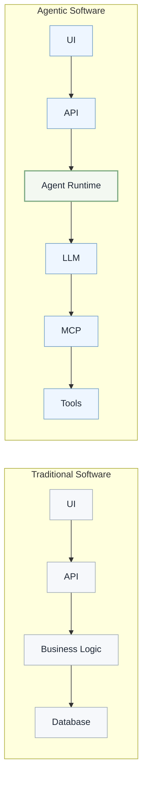
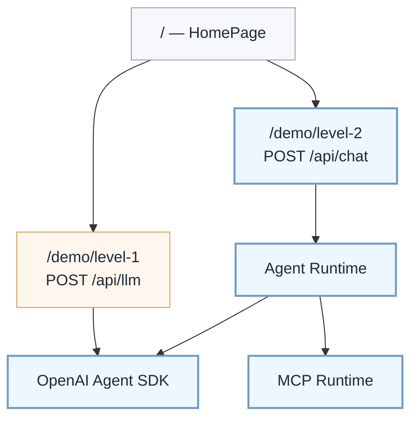
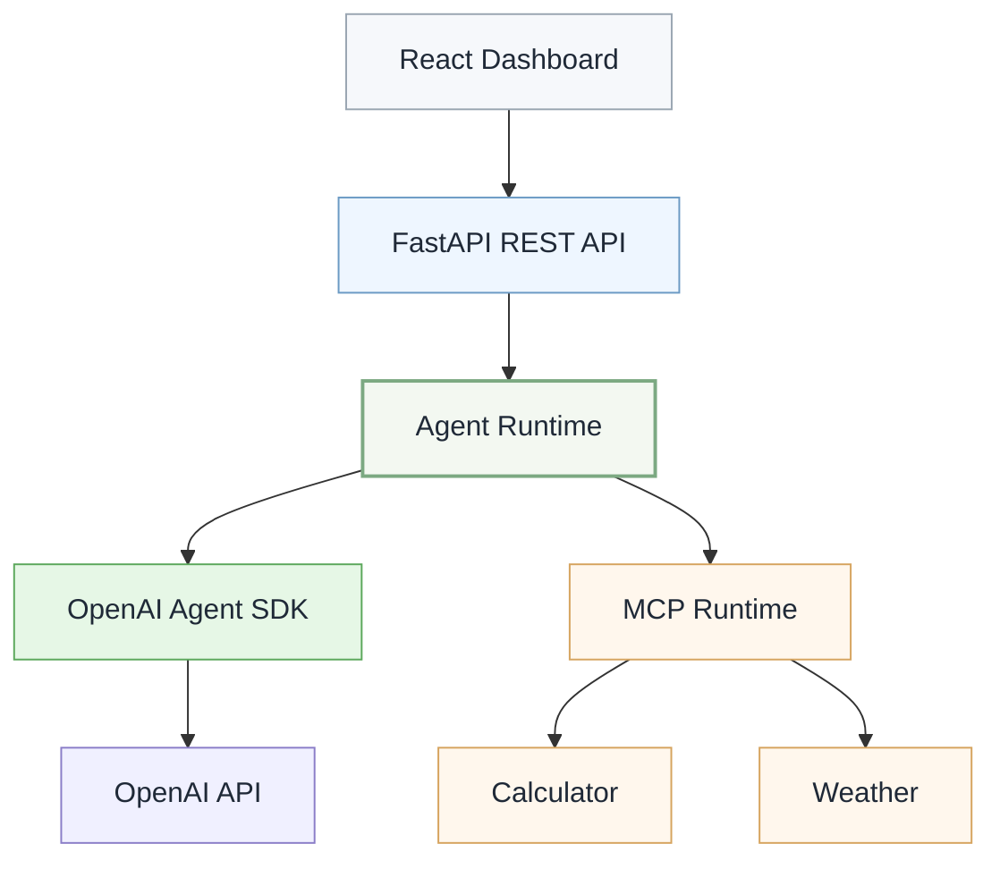
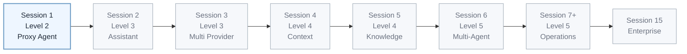
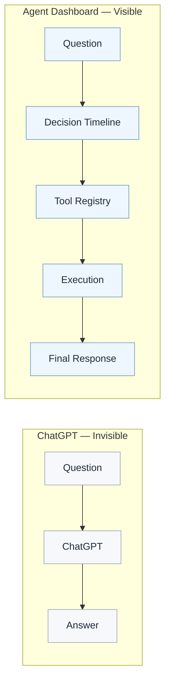
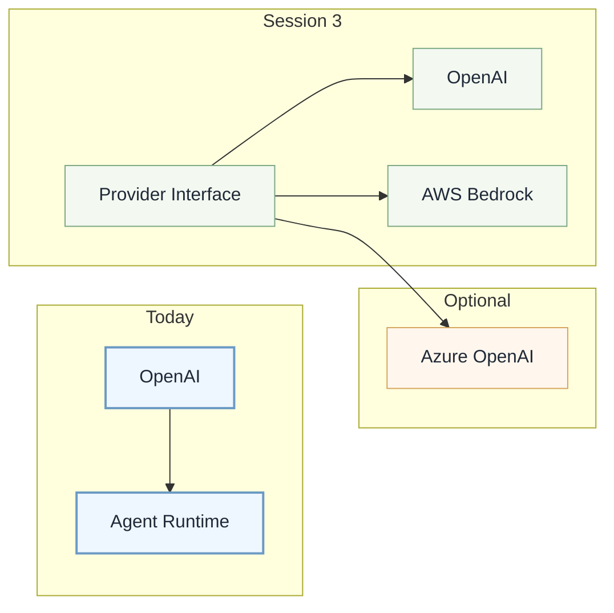
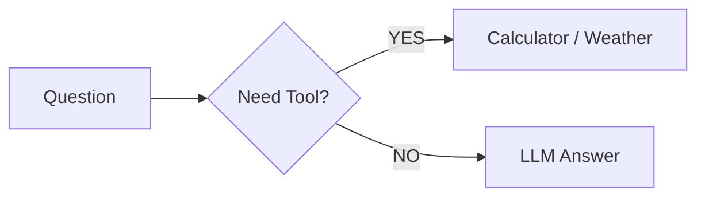

# Demo 1 — Build Your First AI Agent

**Swamy's Tech Skills Academy · July session**

Detailed presenter script and execution guide for Demo 1.

> **Teaching Product note:** Attendees run from the public repo using the root [README.md](../../README.md) and this session's [README.md](./README.md). Relative links below to `docs/…` are for instructors working in the private Engineering Organization — those files are not published ([ADR-013](../../docs/ADRs/ADR-013-lean-teaching-product.md)).

| | |
| --- | --- |
| **Duration** | ~45 minutes |
| **Maturity levels** | **Level 1** — Direct LLM and **Level 2** — Proxy Agent ([§4.1](../../docs/02-master-plan.md#41-agent-maturity-levels)) |
| **App entry** | [http://localhost:5173](http://localhost:5173) (Home) |
| **Tag when complete** | After Demo 1, create and push `v1.0-build-your-first-agent` |
| **Dashboard reference** | [docs/13-observability-dashboard.md](../../docs/13-observability-dashboard.md) |
| **Attendee setup** | Root [README.md](../../README.md) (private instructors may also use [docs/03-getting-started.md](../../docs/03-getting-started.md)) |
| **Master plan** | [docs/02-master-plan.md](../../docs/02-master-plan.md) |

### App routes (Demo 1)

| Route | Maturity | API | Purpose |
| ----- | -------- | --- | ------- |
| `/` | Overview | — | Home — maturity ladder + links to both demos |
| `/demo/level-1` | Level 1 | `POST /api/llm` | Direct LLM — prompt + response only |
| `/demo/level-2` | Level 2 | `POST /api/chat` | Agent Dashboard — Session 1 deliverable |

After Demo 1 is complete, create and push the Git tag `v1.0-build-your-first-agent` to freeze **Level 2** plus the Home and Level 1 contrast paths in the same frontend.

> **Presenter framing:** Demo 1 code is already on `main`. This July session is a **walkthrough and guided extension** of the implemented stack — not greenfield scaffolding. Attendees arrive with the app running per [03-getting-started.md](../../docs/03-getting-started.md).

> **Documentation governance:** This file teaches Demo 1 live. Canonical architecture and maturity levels: [master plan §4](../../docs/02-master-plan.md#4-architecture-mental-model). Decision Timeline contract: [13-observability-dashboard.md](../../docs/13-observability-dashboard.md). Prefer linking over duplicating — see [Documentation governance](../../docs/02-master-plan.md#documentation-governance).

### Presenter note — Demo 1 timeline instrumentation

In Session 1, the Decision Timeline is **orchestrated by the Agent Runtime**, not streamed from raw SDK callbacks:

- `IntentIdentified` and `ExecutionPlanCreated` come from lightweight regex heuristics in `agent_runtime/agent.py` (`_infer_intent`) so the room sees a full narrative on the first prompt.
- `ToolSelected` / `ToolInvoked` / `ToolCompleted` are emitted around the OpenAI Agent SDK + MCP run; `ToolCompleted.result` carries the **final agent text** for Demo 1 (not isolated tool JSON). `latencyMs` is reserved for Session 7+ tracing.
- The backend automatically manages the MCP stdio server lifecycle for each `/api/chat` request in Demo 1 — no separate MCP terminal is required; Session 7 productionizes boundaries.

When narrating Segment 4, say **"the runtime classified intent and chose a tool"** rather than implying the UI reads hidden chain-of-thought from the model. Session 2+ can tighten instrumentation toward SDK/tool callbacks and failure events (`ToolFailedHandled`).

---

## What you will demonstrate

> "Today we are not learning OpenAI. We are learning how to engineer an Agent Runtime."

### What are we building?



```text
Traditional                        Agentic

  UI                                  UI
   │                                   │
   ▼                                   ▼
  API                                 API
   │                                   │
   ▼                                   ▼
 Business Logic               Agent Runtime
   │                                   │
   ▼                                   ▼
 Database                             LLM
                                       │
                                       ▼
                                      MCP
                                       │
                                       ▼
                                     Tools
```

By the end of this session, the audience should understand:

1. **Agentic software replaces Business Logic with an Agent Runtime** — the system boundary that owns instructions, planning, context, tool calling, and events. The LLM is just another dependency.
2. **An AI agent decides when to call external tools** — the Decision Timeline makes this visible.
3. **MCP standardizes the tool plug shape** — swap the tool, keep the runtime.
4. **The Agent Dashboard exposes what the agent decided**, not just the final answer.
5. **Session 1 is the foundation of a 15-session curriculum** — every session extends this same codebase.
6. **Provider abstraction comes later** — after the first agent loop is clear.
7. **Today lands at Agent Maturity Level 2** — instruction-based tool calling with prompt-scoped context, not raw LLM chat (Level 1 at `/demo/level-1`) and not session memory yet (Level 3).
8. **One app, two maturity paths** — Home orients attendees; Level 1 and Level 2 are separate routes with separate API boundaries.



**Level 2 stack (Session 1 deliverable):**



```text
/  or  /demo/level-2

React Dashboard (/demo/level-2)
                            │
                            ▼
                     FastAPI REST API
                            │
                            ▼
                      Agent Runtime
                            │
             ┌──────────────┴──────────────┐
             │                             │
             ▼                             ▼
     OpenAI Agent SDK                 MCP Runtime
             │                             │
             ▼                  ┌──────────┴──────────┐
        OpenAI API               ▼                     ▼
                           Calculator             Weather
```

> **Note:** You do **not** start the MCP server in its own terminal for Demo 1. The backend spawns it via stdio on each `POST /api/chat` request.

---

## Pre-session checklist

### One week before (attendees)

Send a link to [docs/03-getting-started.md](../../docs/03-getting-started.md) and ask them to complete **Developer Setup**:

- [ ] Python 3.13+, Node 20 LTS, `uv`, Git installed
- [ ] Repo cloned
- [ ] `.env` created from `.env.example` with OpenAI credentials
- [ ] `uv sync --all-groups` from repo root
- [ ] `npm --prefix src/frontend install` from repo root

### Night before / morning of (presenter)

- [ ] Pull latest `main`
- [ ] Run the [smoke test](#smoke-test-5-minutes) below
- [ ] Close apps using ports **8000** and **5173**
- [ ] Browser: one clean window, zoom 100%, bookmarks cleared of distractions
- [ ] Terminal font size readable for the room (14–16pt minimum)
- [ ] `.env` at repo root with valid OpenAI credentials
- [ ] Optional: set `OPENWEATHER_API_KEY` for live weather (demo fallback works without it)

### 10 minutes before going live

```powershell
cd D:\GitHub\agentic-engineering-in-practice

# Known-good checkpoint — instant rollback if live coding goes wrong
git tag -a session-1-live-start -m "Checkpoint before Demo 1 live session"

# Quick verify
uv run pytest -q
```

---

## How to execute the solution

### Step 1 — Open two terminals (presenter machine)

**Terminal 1 — Backend** (repository root)

```powershell
cd D:\GitHub\agentic-engineering-in-practice
uv sync --all-groups
uv run uvicorn app.main:app --app-dir src/backend --reload --port 8000
```

Wait for:

```text
Application startup complete.
Uvicorn running on http://127.0.0.1:8000
```

**Terminal 2 — Frontend**

```powershell
cd D:\GitHub\agentic-engineering-in-practice
npm run dev
```

Wait for:

```text
Local:   http://127.0.0.1:5173/
```

### Step 2 — Open the app

Browser: [http://localhost:5173](http://localhost:5173) — **Home** with maturity ladder and CTAs.

| Route | Purpose |
| ----- | ------- |
| `/` | Home — maturity overview + links to both demos |
| `/demo/level-1` | Level 1 — raw LLM (`POST /api/llm`), text only |
| `/demo/level-2` | Level 2 — Agent Dashboard (`POST /api/chat`) |

For the live session, start on **Home** or go directly to `/demo/level-1` for the opening contrast.

**Level 2 dashboard** panels (top to bottom on `/demo/level-2`):

| Panel | Purpose |
| ----- | ------- |
| **Direct LLM vs Agentic** | Level 1 vs Level 2 contrast — collapse after the opening narrative |
| **Prompt** | User input + suggestion chips |
| **Decision Timeline** | Structured execution events |
| **Tool Registry** | `calculate` and `get_weather` lifecycle |
| **Tool Execution** | Params and results per tool call |
| **Final Response** | Agent answer |

### Step 3 — Optional health check (backup if UI fails)

```powershell
Invoke-RestMethod http://127.0.0.1:8000/health
```

Expected: `{"status":"ok","demo":"1","maturityLevel":2,"maturityName":"PROXY_AGENT"}`

### Step 4 — Run the killer demos

See [Live demo script](#live-demo-script-45-minutes) below.

### Step 5 — Stop services after session

`Ctrl+C` in both terminals.

---

## Smoke test (5 minutes)

Run this before every presentation:

```powershell
cd D:\GitHub\agentic-engineering-in-practice

# 1. Unit + integration tests
uv run pytest -q

# 2. Start backend (separate terminal or background)
uv run uvicorn app.main:app --app-dir src/backend --port 8000

# 3. LLM API smoke test (Level 1 — no events)
$body = '{"message":"hello"}'
$r = Invoke-RestMethod -Uri "http://127.0.0.1:8000/api/llm" `
  -Method POST -ContentType "application/json" -Body $body
Write-Host $r.response
Write-Host $r.maturityLevel   # expect: 1

# 4. Agent API smoke test (Level 2)
$body = '{"message":"What is 15 * 23?"}'
$r = Invoke-RestMethod -Uri "http://127.0.0.1:8000/api/chat" `
  -Method POST -ContentType "application/json" -Body $body
Write-Host $r.response          # expect: response contains 345
Write-Host $r.maturityLevel     # expect: 2
Write-Host $r.maturityName      # expect: PROXY_AGENT
Write-Host $r.events.Count      # expect: 8 events (Demo 1 baseline — re-verify after Session 2 streaming)

# Optional — full backend E2E (health + Level 1 + Level 2)
# powershell -File tools/e2e-smoke.ps1

# 5. Frontend build (catches TypeScript errors)
cd src\frontend
npm run build
```

---

## Live demo script (~45 minutes)

### Segment 1 — Level 1 baseline and where today fits (0:00 – 5:00)

#### 1a — Level 1: raw LLM interaction (0:00 – 2:30)

**Optional prop:** Use `/demo/level-1` for the Level 1 live demo — or ChatGPT in a second tab. Do **not** open Level 2 until you are ready to contrast agentic behavior.

**Show:** Level 1 flow on `/demo/level-1` (or diagram from [§4.1](../../docs/02-master-plan.md#41-agent-maturity-levels)):

```text
User
   │
   ▼
Raw LLM Prompt
   │
   ▼
LLM Response
```

**Say:**

> "This is **Level 1 — Direct LLM Interaction**. Stateless. Human-led. Question in, answer out. No tools, no timeline, no runtime boundary. Most people start here — and many never leave."

**Live (optional, ~30 seconds):** On `/demo/level-1`, ask `What is 15 * 23?` — show answer with **no** tool trace. Then navigate to `/demo/level-2` and ask the same prompt.

**Say:**

> "You got an answer — but you cannot see whether the model calculated, guessed, or called anything. There is no engineering surface to observe or extend."

**Show:** Level 2 target — what Demo 1 builds:

```text
User
   │
   ▼
Agent Runtime
   │
   ├── Instructions
   ├── Tool Selection
   ├── MCP
   └── Decision Timeline
```

**Say:**

> "Today we cross from Level 1 to **Level 2 — Proxy Agent**. Same LLM underneath, but wrapped in an **Agent Runtime** that owns instructions, tool selection, MCP, and structured events. That is the architectural move this session teaches."

#### 1b — Curriculum context (2:30 – 5:00)

**Show:** The 15-session journey with maturity levels.



```text
Session 1  →  Session 2  →  Session 3  →  Session 4  →  Session 5  →  …  →  Session 15
 Level 2       Level 3       Level 3       Level 4       Level 4              Level 5
 Proxy         Assistant     Assistant     Autonomous    Autonomous             Enterprise
 Agent         System        + Providers   Agent         + Knowledge            Platform

 ═══ Today: Level 2 ═══
```

**Say:**

> "This is a 15-session curriculum mapped to **Agent Maturity Levels** — see [§4.1 in the master plan](../../docs/02-master-plan.md#41-agent-maturity-levels). Today is Session 1 at **Level 2**: a Proxy Agent with tool calling and a dashboard that shows every decision. Every future session extends this same codebase, not a new one."

**Say:**

> "The goal today is **not** a complete application. It's the smallest foundation that lets us climb the maturity ladder toward an Enterprise AI Platform."

**Point:** Highlight S1 (Level 2) → S3 (Level 3) → S4 (Level 4) → S6 (Level 5) → S15.

**Say:**

> "Session 2 moves us to **Level 3 — Assistant System** with conversation state. Session 4 introduces **working context and contextual reasoning** at Level 4 — not cross-user personalization; that stays a future capability. Session 6 reaches **Level 5** with multi-agent coordination; Sessions 7–15 deepen that same maturity through production, evaluation, and enterprise operations."

**Show:** The three engineering threads.

**Say:**

> "This curriculum has three engineering threads that weave through every session — and they align with the maturity levels."

```text
Agent Evolution          MCP Evolution            Platform Evolution
─────────────────        ───────────────          ──────────────────
Level 2 Agent    →       Calculator       →       Local
Level 3 State    →       Reusable          →      Providers
Level 4 Context  →       Knowledge          →     Distributed
Level 5 Multi    →       Production          →    Cloud / Enterprise
```

**Say:**

> "The Agent thread climbs maturity levels. The MCP thread turns tools into reusable services. The Platform thread takes us from localhost to the enterprise. Today advances all three — starting at Level 2."

**Presenter note:** Progression through maturity levels is **incremental**, not a strict certification. A session may preview the next level without fully implementing it. Say that once if the room asks about Session 4 vs 'persistent memory'.

---

### Segment 2 — Why this Architecture? (5:00 – 12:00)

**Show:** The ChatGPT vs Agent Dashboard comparison.



```text
ChatGPT — Invisible               Agent Dashboard — Visible

Question                              Question
    │                                     │
    ▼                                     ▼
  ChatGPT                          Decision Timeline
    │                                     │
    ▼                                     ▼
  Answer                            Tool Registry
                                          │
                                          ▼
                                      Execution
                                          │
                                          ▼
                                    Final Response
```

**Say:**

> "ChatGPT — or our `/demo/level-1` page — is a black box: question in, answer out. The Agent Dashboard at `/demo/level-2` makes every decision visible: the timeline, the tool selection, the execution, and the final response. That's the difference between a chatbot and an agent platform."

**Say:**

> "Now — why this architecture? It's built around the **Agent Runtime**, not around the LLM. The Agent Runtime owns everything the developer cares about."

**Show:** Agent Runtime responsibilities.

```text
Agent Runtime
├── Instructions
├── Planning
├── Context              (prompt-scoped today — Level 2)
├── Tool Calling
├── Events
├── Memory               (Session 2 — conversation state, Level 3)
├── Working Context       (Sessions 4–6 — context assembly, Level 4)
├── Knowledge            (Session 5 — RAG, Level 4)
└── Providers            (Session 3 — Level 3)
```

**Say:**

> "The LLM is just another dependency — like a database. The Agent Runtime is what makes the system extensible, observable, and provider-independent. Today at Level 2 we own instructions, planning, prompt-scoped context, tool calling, and events. **Conversation state** arrives in Session 2; **working context** (context assembly, not user profiles) in Session 4; providers in Session 3."

**Show:** What makes an AI Agent?

**Say:**

> "Before we go deeper — let's be clear about what an AI agent actually is."

```text
LLM

≠

AI Agent
```

**Say:**

> "An LLM answers questions. An AI Agent decides whether to answer from knowledge, call a tool, or ask for clarification."

```text
AI Agent

=

LLM

+

Instructions

+

Planning

+

Tool Calling

+

Memory          (Session 2)

+

Knowledge       (Session 5)

+

Observability   (Session 7)
```

**Say:**

> "Today we walk the foundation already in the repo: LLM + instructions + planning + tool calling + events. Everything else gets layered on in future sessions, but the Agent Runtime stays."

**Show:** What we are NOT building today.

```text
Today                              Not Today
───                                ─────────
✅ OpenAI                          ❌ Memory
✅ MCP Calculator                  ❌ RAG
✅ MCP Weather                     ❌ Multi Agent
✅ Decision Timeline               ❌ Kubernetes
✅ Tool Registry                   ❌ AWS Bedrock
✅ Execution                       ❌ Azure OpenAI
                                   ❌ Model Gateway
```

**Say:**

> "This scope boundary is intentional. If someone asks 'Can we use Claude?' or 'What about Bedrock?' — the answer is Session 3."
>
> **Good architecture introduces abstractions only after the problem is understood.**

**Show:** Provider evolution preview.



```text
 Today              Session 3            Optional
 ─────              ─────────            ────────
 OpenAI  ──►   Provider Interface  ──►   Azure OpenAI
                    │
                    ├──► OpenAI
                    │
                    └──► AWS Bedrock
```

**Say:**

> "Today the model is hard-coded. We do that deliberately — once you've seen the agent loop work directly, you'll understand exactly why a Provider Interface matters in Session 3. Abstractions after the problem is understood."

**Show:** Architecture diagram or [docs/02-master-plan.md §4](../../docs/02-master-plan.md).

**Say:**

> "The UI talks to FastAPI. FastAPI runs the Agent Runtime with the OpenAI Agent SDK. Tools stay behind our MCP server over stdio — calculator and weather."

**Show:** `src/mcp-server/tools/calculator.py` and `weather.py` briefly.

**Say:**

> "These tools are pre-built. The live lesson is the agent loop: instructions, tool registration, timeline events, and the runtime deciding what to call. MCP is the standard plug shape. Swap the tool, keep the runtime."

**Say:**

> "But why MCP? Let me show you the problem it solves."

**Show:** Without MCP vs With MCP.

```text
Without MCP

Agent
  │
  ├── Calculator API     ← custom REST
  ├── Weather API        ← different auth
  ├── Database API       ← different protocol
  ├── Slack API          ← different SDK
  └── Email API          ← different format

Every integration is bespoke.
```

```text
With MCP

Agent
  │
  └── MCP Runtime
        │
        ├── Calculator    ← uniform
        ├── Weather         protocol
        ├── Database
        ├── Slack
        └── Email

One plug shape, any tool.
```

**Say:**

> "Without MCP, every tool integration is bespoke — custom auth, custom SDK, custom error handling. With MCP, there's one protocol, one lifecycle, one contract. That's the standard plug shape. Calculator and Weather today; any tool in future sessions."

---

### Segment 3 — Start the stack (12:00 – 14:00)

**Show:** Run [Step 1](#step-1--open-two-terminals-presenter-machine) live or have terminals pre-started.

**Say:**

> "Two processes: backend on 8000, frontend on 5173. Notice we are **not** starting MCP separately — the agent runtime launches it on each `/api/chat` request."

**Show:** [http://localhost:5173/demo/level-2](http://localhost:5173/demo/level-2) — point at the **Direct LLM vs Agentic** panel first, then each dashboard panel below.

---

### Segment 4 — How an Agent decides (14:00 – 22:00)

**Say:**

> "Let me show you what the Agent Runtime actually does when a question arrives. It decides whether to use a tool or answer directly."

**Prompt (type or click suggestion chip):**

```text
What is 15 * 23?
```

**Show — after the HTTP response returns, walk the completed timeline top-to-bottom** (Demo 1 is batch, not streamed):

| Order | Decision Timeline event | What to say |
| ----- | ------------------------ | ----------- |
| 1 | `PromptReceived` | "The request entered the system." |
| 2 | `IntentIdentified` | "We classified this as arithmetic — not weather, not chit-chat." |
| 3 | `ExecutionPlanCreated` | "Plan: use a tool, not answer from memory." |
| 4 | `ToolSelected` | "Agent picked **calculate**." |
| 5 | `ToolInvoked` | "Calling MCP…" |
| 6 | `ToolCompleted` | "Agent completed the tool path; `result` shows the synthesized answer text (Demo 1 teaching shortcut)." |
| 7 | `ResponseSynthesized` | "Agent composes the final answer." |
| 8 | `ResponseDelivered` | "UI receives the response." |

**Show — Tool Registry:**

> "After the response, the registry shows ✅ Success for `calculate`. The event stream represents ⚪ Available → 🔵 Selected → 🟢 Running → ✅ Success — Demo 1 updates the UI in one batch."

**Show — Final Response:**

> "Answer contains 345 — correct. The model didn't guess; it **used a tool**."

**Say:**

> "That's one decision path: question needs a tool, tool runs, answer comes back. Now let's see a different intent use a different tool."

**Prompt (type or click suggestion chip):**

```text
What's the weather in Seattle?
```

**Show — contrast with calculator:**

> "Different intent → different tool. Watch **`get_weather`** in the registry this time, not `calculate`."

**Show — Tool Execution panel:**

> "Here you see the params sent and the result returned — that's the audit trail."

**Say (if no OpenWeather key):**

> "Without an API key we get demo-mode weather data. Add `OPENWEATHER_API_KEY` to `.env` for live data — same agent flow."

**Say:**

> "Two tool paths, two different results, same Runtime. Now let's see what happens when no tool is needed."

**Show:** How an Agent decides.



```text
                 ┌──────────────────┐
                 │ Calculator       │
          YES    │ Weather          │
                 └──────────────────┘
Question ──► Need Tool?
                 │
          NO     ┌──────────────────┐
                 │ LLM Answer       │
                 └──────────────────┘
```

**Say:**

> "The Agent Runtime decides whether a tool is required. Calculator, weather — both tools. But what about a knowledge question?"

**Prompt (type manually — not an on-screen chip):**

```text
What is SOLID?
```

**Show — narrate the decision timeline:**

| Event | What to say |
| ----- | ----------- |
| `PromptReceived` | "Request entered the system." |
| `IntentIdentified` | "This is a knowledge question — no tool needed." |
| `ExecutionPlanCreated` | "Plan: answer from LLM knowledge." |
| `ResponseSynthesized` | "Direct from the model's training data." |
| `ResponseDelivered` | "Not a single tool event appeared." |

**Say:**

> "No tool selected. The agent answered directly from knowledge. But the Decision Timeline still shows the full decision path — that's the difference between an agent and a blind API call."

**Say:**

> "Calculator needed a tool. Weather needed a tool. SOLID did not. The same Runtime decided all three. That's what we mean by **How an Agent decides**."

**Optional — show code path (30 sec):**

- `src/backend/app/agent_runtime/agent.py` — MCP stdio spawn
- `src/mcp-server/server.py` — `@mcp.tool()` for `calculate`

---

### Segment 5 — Decision visibility (22:00 – 27:00)

**Say:**

> "Every decision produces events. Let's look at the contract that makes this possible."

**Show:** `POST /api/chat` in browser DevTools → Network tab, or:

```powershell
Invoke-RestMethod -Uri "http://127.0.0.1:8000/api/chat" `
  -Method POST -ContentType "application/json" `
  -Body '{"message":"What is 15 * 23?"}' | ConvertTo-Json -Depth 5
```

**Say:**

> "The response includes both `response` and `events[]`. The events array is what powers the Decision Timeline. Same contract for every prompt — calculator, weather, or knowledge."

**Say:**

> "This contract is the key insight. The same `events[]` stream that powers today's dashboard will feed Session 7's observability. No redesign needed."

---

### Segment 6 — Engineering highlights (27:00 – 35:00)

**Show:** Shared contract — same event shape backend and frontend.

| Artifact | Path |
| -------- | ---- |
| Pydantic models | `src/backend/app/agent_runtime/models.py` |
| TypeScript types | `src/frontend/src/types/decision-event.ts` |
| Event bus | `src/backend/app/agent_runtime/event_bus.py` |

**Say:**

> "We defined **DecisionEvent** once in Session 1. Session 7's production foundations will consume the **same stream** — no redesign."

**Say:**

> "Today's code is the shared foundation. Every file we touched — the event bus, the models, the agent loop — gets extended, not replaced. That's the engineering discipline this curriculum teaches."

---

### Segment 7 — The journey ahead (35:00 – 45:00)

**Show:** The full journey (maturity + sessions).

```text
Today (Level 2)                Next (Level 3)              Then
───────────────                ────────────────              ────
✅ Proxy Agent                  Session 2                     Session 3
✅ Tool calling + MCP           Conversation state            Multi-provider
✅ Decision Timeline           Streaming                     Provider Interface
✅ Prompt-scoped context       SQLite sessions                  ↓
✅ OpenAI (direct)                                                Session 4 (Level 4)
                                                                   Working memory + context
                                                                     ↓
                                                                 Session 5 (Level 4)
                                                                   Knowledge (RAG)
                                                                     ↓
                                                                 Session 6 (Level 5)
                                                                   Multi-agent
                                                                     ↓
                                                                 Sessions 7–15 (Level 5)
                                                                   Production → Enterprise
```

**Say:**

> "Today we built a **Level 2 Proxy Agent** — stateless across sessions, instruction-based tool calling, prompt-scoped context, full decision visibility. Session 2 adds **Level 3** conversation state and streaming — the same dashboard, same codebase, new maturity characteristics."

**Say:**

> "Session 3 stays at Level 3 but adds the Provider Interface. Session 4 moves toward **Level 4 Autonomous Agent** with working context and contextual reasoning — assembly and compression, not cross-user personalization. Session 5 adds knowledge retrieval at the same maturity level. Session 6 reaches **Level 5** with multi-agent orchestration; Sessions 7–15 deepen Level 5 through production, evaluation, governance, and enterprise deployment."

**Say:**

> "Session 15 is an Enterprise AI Platform — still Level 5 maturity, now cloud-deployed with model gateway, tracing, and production monitoring. Everything we built today is still running underneath."

**Show:** README roadmap table — Demo 1 ✅ Released (`v1.0-build-your-first-agent`) → Demo 2 📅.

**Tag the milestone:**

```powershell
git tag -a v1.0-build-your-first-agent -m "Demo 1: Build Your First AI Agent"
git push origin v1.0-build-your-first-agent
```

**Say:**

> "Everything we built today is frozen at tag `v1.0-build-your-first-agent`. Clone the repo, checkout that tag, and you have exactly what we demoed — Home, Level 1 at `/demo/level-1`, and the Level 2 Proxy Agent at `/demo/level-2`. Next session: conversation state and streaming — the Agent Runtime climbs to Level 3."

---

## Presenter cheat sheet

### Agent maturity levels (reference)

Condensed from [§4.1](../../docs/02-master-plan.md#41-agent-maturity-levels). Use when explaining *why* a future session exists, not as a checklist.

| Level | Agent Type | Route / API | Today? |
| ----- | ---------- | ----------- | ------ |
| **1** | Direct LLM Interaction | `/demo/level-1` · `POST /api/llm` | Opening compare (5 min) |
| **2** | Proxy Agent | `/demo/level-2` · `POST /api/chat` | **Yes — Session 1 deliverable** |
| **3** | Assistant System | *(Session 2–3)* | — |
| **4** | Autonomous Agent | *(Sessions 4–6)* | — |
| **5** | Multi-Agent System | *(Session 6 onward)* | — |

**Compare prompt (both levels):** `What is 15 * 23?` — Level 1 returns text only; Level 2 shows `calculate` in the timeline.

**Memory distinction (if asked):**

| Memory Type | When |
| ----------- | ---- |
| Conversation State | Session 2 |
| Agent Working Context | Sessions 4–6 |
| Persistent User Memory | Future / TBD |

### Suggestion prompts

| Prompt | On-screen chip? | Expected tool | Expected answer shape |
| ------ | --------------- | ------------- | --------------------- |
| `What is 15 * 23?` | ✅ | `calculate` | `345` |
| `What's the weather in Seattle?` | ✅ | `get_weather` | Weather description for Seattle |
| `What is SOLID?` | ❌ type manually | *(none)* | Direct explanation, no tool events |
| `What is an AI agent?` | ❌ type manually | *(none)* | Direct explanation, no tool events |

### Agent Runtime responsibilities (key talking points)

| Responsibility | Present today? | Evolves in |
| -------------- | -------------- | ---------- |
| Instructions | ✅ | — |
| Planning | ✅ | — |
| Context | ✅ (prompt-scoped, Level 2) | Session 4 (working context) |
| Tool Calling | ✅ | — |
| Events | ✅ | Session 6–7 |
| Conversation State | ❌ | Session 2 (Level 3) |
| Working Context | ❌ | Sessions 4–6 (Level 4) |
| Knowledge | ❌ | Session 5 (Level 4) |
| Providers | ❌ | Session 3 (Level 3) |

### Tool Registry state legend

UI uses Font Awesome icons with text labels (see `ToolRegistry.tsx`):

| Label | State | Driven by |
| ----- | ----- | --------- |
| Available | Idle | Tool registered, not yet used |
| Selected | Chosen | `ToolSelected` |
| Running | In flight | `ToolInvoked` |
| Success | Done | `ToolCompleted` |
| Handled | Recovered failure | `ToolFailedHandled` (not emitted on Demo 1 happy path) |
| Failed | Hard failure | `ToolFailedUnhandled` (Demo 1 UI). `SystemErrorRaised` is timeline/Final Response only |

### Key files to have open in IDE (tabs)

1. `src/frontend/src/App.tsx` — routes (`/`, `/demo/level-1`, `/demo/level-2`)
2. `src/frontend/src/pages/Level1DemoPage.tsx` — Level 1 UI
3. `src/frontend/src/pages/Level2DashboardPage.tsx` — Agent Dashboard
4. `src/backend/app/agent_runtime/direct_llm.py` — Level 1 API path
5. `src/backend/app/agent_runtime/agent.py` — Level 2 agent + MCP wiring
6. `src/mcp-server/server.py` — tool definitions
7. `src/backend/app/agent_runtime/models.py` — `DecisionEvent`, `ChatResponse`, `LlmResponse`, `HealthResponse`

---

## Troubleshooting during the live session

| Symptom | Quick fix |
| ------- | --------- |
| `OPENAI_API_KEY is not set` in Final Response | Ensure `.env` is at **repo root**, restart backend |
| Blank timeline / network error | Backend not running on 8000; check Terminal 1 |
| CORS or fetch failed | Use `localhost:5173` (Vite proxy), not file://; confirm route (`/demo/level-1` vs `/demo/level-2`) |
| `npm ERR! enoent` while starting frontend | Run from repo root with `npm run dev`, or use `npm --prefix src/frontend run dev` |
| Port already in use | `Get-NetTCPConnection -LocalPort 8000` / `5173`, stop conflicting process |
| Agent error / MCP spawn fail | `uv sync --all-groups` from repo root; verify `uv` on PATH |
| Wrong or slow response | Check OpenAI quota; retry with suggestion chip |
| Demo breaks mid-session | `git checkout session-1-live-start` |

**Presenter escape hatch:**

```powershell
git checkout session-1-live-start
# Restart backend + frontend
```

---

## After the session

- [ ] Push tag `v1.0-build-your-first-agent`
- [ ] Create GitHub Release `v1.0-build-your-first-agent` with session notes and links
- [ ] Update README Demo 1 status if you mark it complete
- [ ] Note any issues in GitHub Issues (or `.github/workitems/`) for post-mortem
- [ ] Share [docs/03-getting-started.md](../../docs/03-getting-started.md) with anyone who couldn't set up beforehand

---

## Related documentation

| Doc | Purpose |
| --- | ------- |
| [ADR-007](../../docs/ADRs/ADR-007-demo-routing-level1-level2.md) | Why Home + Level 1 + Level 2 routes (Option 2) |
| [03-getting-started.md](../../docs/03-getting-started.md) | Attendee Developer Setup |
| [04-introduction.md](../../docs/04-introduction.md) | Series overview |
| [05-ai-agents.md](../../docs/05-ai-agents.md) | Agent concepts |
| [08-tool-calling.md](../../docs/08-tool-calling.md) | Killer demo flow |
| [13-observability-dashboard.md](../../docs/13-observability-dashboard.md) | Dashboard + event contract |
| [02-master-plan.md §4.1](../../docs/02-master-plan.md#41-agent-maturity-levels) | Agent Maturity Levels taxonomy |
| [02-master-plan.md](../../docs/02-master-plan.md) | Full series roadmap |
| [01-repository-structure.md](../../docs/01-repository-structure.md) | Folder layout |
| [architecture/demo-1-stack.md](../../docs/architecture/demo-1-stack.md) | Demo 1 file map |
